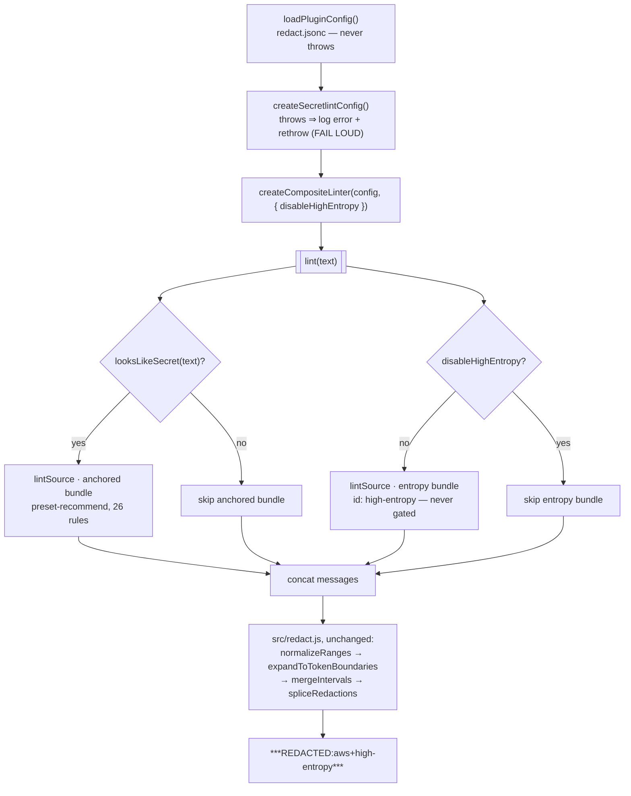
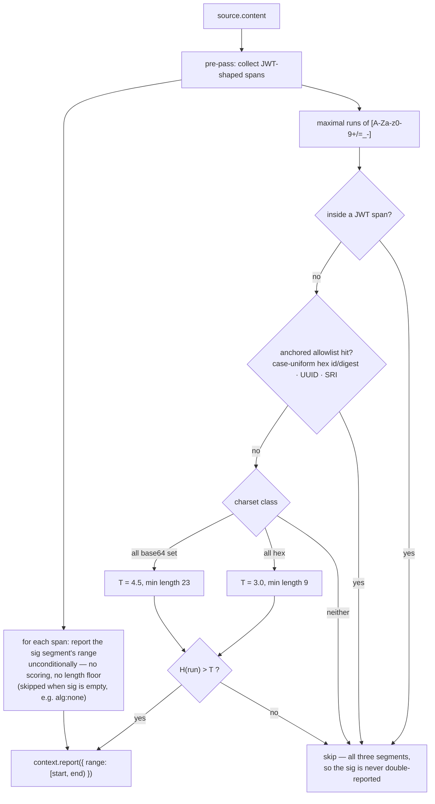

# Design — add-high-entropy-detection

## Context

See `proposal.md — Why` for motivation. This section records only the constraints
that shape the approach.

**The blocking constraint the proposal does not account for.** `src/redact.js`
short-circuits *before* the scanner runs:

```js
if (typeof text !== "string" || text.length === 0 || !looksLikeSecret(text)) {
  return { text, redactionCount: 0, ruleIds: [] };   // scanAndRedact AND redactUserMessage
}
```

`looksLikeSecret` is a literal-anchor table mirroring the recommend preset. A
high-entropy string has, by definition, **no literal anchor**. Registering the
rule without touching `redact.js` would produce a detector that can never fire
except on text that some *other* rule's anchor already admitted. The prescreen is
therefore load-bearing for this change, and the proposal's claim that
`scanAndRedact`/`redactSecrets`/`redactUserMessage` "need no changes" is wrong.

**Verified engine facts** (read from `@secretlint/core@13.0.5` in
`node_modules`, 2026-09-09 — not asserted from training data):

- `lintSource` performs **no config-schema validation**. `registerRule` sets
  `const ruleId = descriptorRule.id` — the reported `message.ruleId` comes from the
  *config entry's* `id`, **not** from `rule.meta.id` (`core/module/index.js:98,126`).
- A rule module is a plain object `{ messages, meta, create(context, options) }`
  returning `{ file(source) }`; `meta.supportedContentTypes: ["text"]` is enough
  for a pure content check (confirmed against the bundled `tailscale`, `azure`
  and `secp256k1-privatekey` rules).
- Message values must be **functions** (`{ en: (props) => string }`) —
  `formatMessage` always invokes them (`core/module/helper/SecretLintRuleMessageTranslator.js`).
- `maskSecrets: true` masks by replacing every **string** value found in a
  message's `data` throughout the message text
  (`core/module/messages/filter-mask-secrets.js`). Numeric props are untouched;
  a props-free message yields `data: undefined` and masking is a no-op.
- Duplicate suppression compares `(range, severity, message)` — two different
  rules reporting the same range are both kept.

**Repository constraints that bound the solution.**

- `test/redact-baseline.test.js` is a committed, **never-regenerate** behavioural
  lock over `redactSecrets` for the whole corpus. Anything that adds findings to
  the linter built by `createSecretlintConfig()` + `createLinter()` breaks it.
- `test/secretlint.test.js` asserts `config.rules` has length **1**.
- `test/redact.test.js` asserts `looksLikeSecret(fixture.content) === true` for
  every entry of `RULE_FIXTURES`.
- `openspec/specs/tool-output-redaction/spec.md` contains a **`Prescreen Must Not
  Skip Detectable Content`** requirement whose scenario demands the prescreen be
  positive "for every detection rule the system supports".

**User decisions taken as given** (explicit, this session): thresholds 4.5
bits/char base64 / 3.0 bits/char hex; an allowlist covering case-uniform git
object ids and hash-output lengths, UUIDs, and a JWT's header and payload — with
the JWT **signature** reported unconditionally; entropy detection is never
prescreen-gated;
integrated as a real secretlint rule module; disableable via a new
`redact.jsonc` in opencode's config directory that fails **open**.

## Goals / Non-Goals

**Goals**

- Make an unanchored detector reachable at all, without weakening or discarding
  the anchored fast path that keeps ordinary tool output cheap.
- Keep `normalizeRanges` / `mergeIntervals` / `spliceRedactions` / the placeholder
  and annotation logic **byte-identical** — the new detector must be just another
  `ruleId` flowing through the existing pipeline.
- Keep `test/redact-baseline.test.js` passing with **zero** baseline edits.
- Give the plugin its first config file with failure semantics that are provably
  distinct from — and cannot be confused with — the existing fail-loud
  secretlint-config startup contract.
- Make every entropy fixture *arithmetically* verifiable, since no vendor
  documentation exists to verify against.

**Non-Goals**

- Configurable thresholds, a user-editable allowlist, or per-rule enable/disable
  for the 26 preset rules. One boolean in v1.
- Per-project (`.opencode/redact.jsonc`) config, config hot-reload, or watching
  the file. Startup-only read; a change requires an opencode restart.
- An `allows` option on the entropy rule (the common secretlint rule convention).
  No config plumbing reaches rule options in v1.
- Changing `expandToTokenBoundaries` semantics for entropy findings. Uniform
  expansion is the existing spec contract and stays.

## Decisions

### D1 — Two rule bundles, one composed linter (not one config)

The proposal says to push the rule into the resolved preset config's `rules`
array. That single line breaks three committed tests and the never-regenerate
baseline, because every fixture in the corpus contains a 27–110 character
high-entropy token that the new rule would also report.

| Option | Consequence | Verdict |
|---|---|---|
| **A.** Append the rule to the config returned by `createSecretlintConfig()`; delete the prescreen so the whole 26-rule preset runs on every tool output. | Simplest wiring. But the anchored preset — a battery of ~40 regexes — now runs unconditionally on every `read`, `grep` and `bash` result, a large unasked-for latency regression; `secretlint.test.js`'s length-1 assertion breaks; every corpus fixture gains a `high-entropy` rule id, so the baseline must be regenerated or the config disabled inside it. | **Rejected** — pays a preset-wide cost to buy an entropy-only capability. |
| **B.** Extend `looksLikeSecret` with a cheap "contains an entropy candidate" test so one config still suffices. | Preserves one lint call and the spec requirement verbatim. But any run of ≥23 base64-charset characters trips it — `getUserAuthenticationToken` is 26 — so for real code, JSON and logs it is true almost always, i.e. option A's cost with an extra scanner bolted on. Also directly contradicts the user's "no prescreen gating for the entropy rule". | **Rejected.** |
| **C.** Two `SecretLintCoreConfig` objects — the existing preset bundle and a hand-built one-rule entropy bundle — bound by two `createLinter` calls and composed above them: the anchored bundle stays behind `looksLikeSecret`, the entropy bundle always runs. Messages are concatenated. | Anchored fast path unchanged; entropy never gated; `createSecretlintConfig`/`createLinter` untouched, so **all three committed tests and the baseline stay valid with no edits**; setting `disableHighEntropy: true` reduces the composite to exactly today's behaviour. | **Chosen.** |

`secretlint.js` gains two exports and changes neither existing one:

```
createEntropyConfig()                                  → SecretLintCoreConfig   (synchronous; no config-loader)
createCompositeLinter(presetConfig, { disableHighEntropy, timeoutMs })
                                                       → lint(text, opts?) => Promise<Message[]>
```

The composite is, in essence:

```
messages = [
  ...(looksLikeSecret(text) ? await presetLint(text, opts)        : []),
  ...(entropyLint          ? await entropyLint(text, { ext: ".txt" }) : []),
]
```

Two consequences worth pinning:

- **`createEntropyConfig` never calls `loadPackagesFromConfigDescriptor`.** There
  is nothing to resolve — the descriptor embeds the rule creator object directly
  (`{ id: "high-entropy", rule: entropyRuleCreator }`), which the config-loader
  would only have produced anyway. No npm publish, no `testReplaceDefinitions`.
- **The entropy pass pins `ext: ".txt"` explicitly.** The rule ignores `ext`
  entirely, and `createLinter`'s `detectExt` runs `JSON.parse` over the whole
  input; pinning the extension avoids parsing a large JSON tool output twice.
  The existing `VIRTUAL_PATH_BASE` / `contentType: "text"` handling is reused
  unchanged — the rule needs no `ext`/`contentType` machinery of its own.

### D2 — The prescreen moves out of `redact.js` into `src/prescreen.js`

`scanAndRedact` and `redactUserMessage` drop their `!looksLikeSecret(text)`
clauses; the `typeof` / `length === 0` guards stay. The prescreen becomes a gate
on *one rule bundle* rather than on the whole pipeline, which is what it always
actually was.

| Option | Verdict |
|---|---|
| Leave `looksLikeSecret` in `redact.js` and import it from `secretlint.js`. | **Rejected** — smallest diff, but `redact.js` is documented as the pure pipeline core that the unit suite drives with a stub `lint`; it would then export a function only the engine layer uses. That is precisely the coupling its D1 boundary exists to prevent. |
| Move it into `secretlint.js`. | **Rejected** — mixes a dependency-free heuristic into the module that imports `@secretlint/core`, so the prescreen can no longer be tested in isolation. |
| **Extract to `src/prescreen.js`** (`SECRET_ANCHOR_PATTERN`, `CREDENTIAL_URL_PATTERN`, `looksLikeSecret`), imported by `secretlint.js`. | **Chosen** — the anchor table is a mirror of the *anchored bundle's* rules and belongs beside it; no heavy imports; `redact.js` shrinks by ~110 lines of code it no longer uses. Pure move, no logic change. |

**Why this is baseline-safe, provably.** The baseline drives `redactSecrets` with
either the real preset linter or a stub. Every `REAL_FIXTURE_ENTRIES` input is
anchor-positive, so removing an early return that never fired for them changes
nothing. Every `STUB_ENTRIES` input either is non-string/empty (still short-circuited
by the surviving guards) or has a stub `lint` that returns a fixed array regardless
of whether it is called — including `"clean text (prescreen negative)"`, whose stub
returns `[]`. The baseline is therefore expected to pass **untouched**, and its
passing is the proof.

Two existing unit tests assert `lint` is *not* called for prescreen-negative text
(`test/redact.test.js:242` and `:347`). Those assertions move to the composite
linter, where the behaviour now lives.

### D3 — Tokenization: maximal charset runs

Candidates are the maximal runs of `[A-Za-z0-9+/=_-]` in the source content —
the union of the standard-base64, base64url and hex alphabets plus padding.

- **Maximal runs are pairwise disjoint by construction**, which answers the
  overlapping-candidate question structurally: the rule can never emit a longer
  finding containing a shorter one, because sub-runs are never considered. Overlap
  *between* the entropy rule and a preset rule is already handled downstream by
  `mergeIntervals`.
- **Why not whitespace-delimited tokens?** They would be safe against
  `expandToTokenBoundaries` (the reported range would already be the whole token)
  but would miss the common case entirely: in `{"apiKey":"a8Fk…"}` the
  whitespace token contains `{ " :` and would be rejected as off-charset.
- **Why include `+` and `/`?** Excluding them would split a standard-base64
  secret into sub-runs that individually fall under the length floor. The cost is
  that POSIX paths form single runs; measured against the thresholds below, a
  path needs roughly 23 near-uniformly distributed distinct characters to clear
  4.5 bits/char, which real paths do not reach.
- **Why include `-` and `_`?** Needed for base64url tokens and required for the
  UUID allowlist to match a run rather than five fragments. Kebab- and
  snake-case identifiers become single runs and score far below threshold.

### D4 — Charset classification and threshold selection

Classification is **most-specific-first** and total:

1. every character in `[0-9a-fA-F]` → **hex**, threshold **3.0**
2. else every character in `[A-Za-z0-9+/=_-]` → **base64**, threshold **4.5**
3. else → not a candidate (unreachable given D3's tokenization, retained as a
   defensive branch)

Ordering matters: every hex run is also a subset of the base64 alphabet, so
without "hex first" the 3.0 threshold would be dead. A run that is neither — for
example prose containing punctuation — never reaches the scorer, because D3 never
emits it as a run.

**Entropy.** Shannon entropy over the run's *own* empirical character
distribution (the detect-secrets definition), not against a global model:

```
H = -Σ (nᵢ/L)·log₂(nᵢ/L)      over the distinct characters of the run
```

A run is reported when **`H > threshold`** — strictly greater, so a run landing
exactly on the threshold is a documented negative (D8 pins one).

**Length floor, derived not invented.** `H ≤ log₂(L)`, so `H > T` is impossible
unless `L > 2^T`:

| Class | Threshold | `2^T` | Minimum length |
|---|---|---|---|
| base64 | 4.5 | 22.63 | **23** |
| hex | 3.0 | 8 | **9** |

The floor is computed from the threshold (`floor(2**T) + 1`) rather than written
as a separate magic number, so the two can never drift apart.

### D5 — Allowlist: anchored, case-uniform, and checked before scoring

Allowlist-**then**-score, matching the user's wording ("exempt from ever being
flagged, checked before entropy scoring"). The outcome is identical either way;
checking first avoids scoring work and makes "never flagged" literal in the code.

Every run predicate is **fully anchored to the entire run** (`^…$`). Unanchored
patterns would exempt any run merely *containing* an exempt shape — so
`550e8400-e29b-41d4-a716-446655440000-REAL_SECRET` correctly stays a candidate.

| # | Shape | Pattern (anchored to the whole run) |
|---|---|---|
| 1 | git object id (abbreviated or full) and md5/sha1/sha256/sha512 hex digests — **case-uniform only** | `^(?:[0-9a-f]{7,12}\|[0-9a-f]{32}\|[0-9a-f]{40}\|[0-9a-f]{64}\|[0-9a-f]{128}\|[0-9A-F]{7,12}\|[0-9A-F]{32}\|[0-9A-F]{40}\|[0-9A-F]{64}\|[0-9A-F]{128})$` |
| 2 | UUID | `^[0-9a-fA-F]{8}-[0-9a-fA-F]{4}-[0-9a-fA-F]{4}-[0-9a-fA-F]{4}-[0-9a-fA-F]{12}$` |
| 3 | Subresource-Integrity / lockfile `integrity` digest | `^sha(?:1\|256\|384\|512)-[A-Za-z0-9+/_-]+={0,2}$` |
| 4 | JWT — **span pre-pass, not a run predicate; partially exempting** | `/\beyJ[A-Za-z0-9_-]{6,}\.[A-Za-z0-9_-]{6,}\.(?<sig>[A-Za-z0-9_-]*)/dg` |

**#1 is case-uniform: a run is exempt only if it is entirely lowercase hex or
entirely uppercase hex.** Git renders object ids in lowercase, and every common
digest tool does the same, so a *mixed-case* hex run of an exempt length is not a
rendered hash — it is a credential that happens to land on that length. Splitting
the predicate into two case-uniform alternations, rather than using
`[0-9a-fA-F]`, recovers detection of exactly that case.

The case-uniformity applies to the **whole** row, not only the git lengths. Leaving
the digest alternatives case-insensitive would re-admit any mixed-case 40-character
run through the sha1-digest branch, which would make the git-id half of the rule
pointless. The UUID predicate (#2) stays case-insensitive: its dash structure is
already specific enough that a credential is not plausibly UUID-shaped by accident.

Note the interaction with D4: hex runs are **classified** case-insensitively but
**scored** case-sensitively — in a mixed-case run, `A` and `a` are distinct symbols,
so mixed case can only raise the measured entropy, never lower it.

The chosen lengths are those git actually renders (`--abbrev` output is 7–12, full
is 40) plus the md5/sha256/sha512 digest lengths. Exempting the user's originally
stated full 7–40 range would, against the 3.0 threshold's length-9 floor, leave the
hex branch able to fire only at lengths 41–63, 65–127 and ≥129 — functionally dead,
since hex credentials are overwhelmingly 32, 40 or 64 characters. **The
case-uniform 32/40/64/128 digest blind spot remains and is accepted** — see Risks.

**#4 cannot be a run predicate, and it is not purely an exemption.** `.` is not in
the candidate charset, so a JWT tokenizes into three separate runs. The rule runs a
pre-pass over the content and, for each JWT-shaped span:

1. **excludes all three segments' runs from generic scoring** — so the header and
   payload are never reported on their own entropy, and the signature is never
   double-reported;
2. **reports the `sig` capture group's range unconditionally** — no entropy
   scoring, no length floor, no allowlist check.

The signature is the credential-equivalent part of the token: it is what makes the
JWT presentable as a bearer credential, and it is the part that must not survive.
Scoring it normally would be wrong, not merely redundant — a short HMAC output can
land under 4.5 bits/char and would then be released intact. Hence *unconditional*.

The `eyJ` prefix is required: a bare "three dot-separated base64url segments"
pattern also matches `1.2.3`. The `d` (hasIndices) flag is what makes the absolute
signature range available as `match.indices.groups.sig`; Node ≥ 16 supports it and
this package requires ≥ 22.5.

**Empty signature (`alg: none`).** The `sig` group is `*`, so an unsigned token
matches with a zero-length capture. A zero-length range would be discarded by
`normalizeRanges` (`end <= start`) anyway; the rule reports nothing in that case.
The header and payload remain exempt. An unsigned token is not a bearer credential,
so this is the correct outcome — documented, not accidental.

**What the reader actually sees, and why it is not "claims stay readable".**
`normalizeRanges` applies `expandToTokenBoundaries` to *every* finding, and a JWT
contains no whitespace, so the emitted placeholder covers the whole token:
`***REDACTED:high-entropy***`, not `eyJhbG….eyJzdWI….***REDACTED:high-entropy***`.

| Option | Verdict |
|---|---|
| **Report only the signature range; accept whitespace expansion widening the placeholder to the whole token.** | **Chosen.** Delivers the security goal in full — a leaked bearer token no longer passes through — with zero change to `redact.js` and no spec delta on `Expand Redaction To Token Boundaries`. The narrow range is still the correct rule-level semantics: it names precisely what the credential is, it keeps a JWT to exactly one finding, and it is already the right range if expansion is ever scoped. |
| Exempt this finding from whitespace expansion so the header and payload survive in the output. | **Deferred, not rejected.** It is the only way to literally keep the claims readable, but it requires a per-finding expansion opt-out in `normalizeRanges` plus a MODIFIED delta on the `Expand Redaction To Token Boundaries` requirement — a change to a shared, security-relevant invariant, bought for a debugging convenience. Out of scope for v1; see Open Questions. |
| Report all three segments. | **Rejected** — identical visible output after expansion, but three findings instead of one and a redaction count inflated 3× per token. |

**#3 is a deliberate addition** motivated by `package-lock.json`: an
`"integrity": "sha512-…"` value is 88 base64 characters of digest, ~5.9 bits/char,
and without this entry reading a lockfile would redact one token per dependency.
It exempts only the *prefixed* form, which is structurally unambiguous. Bare
padded base64 digests (44/88 chars ending `=`/`==`) are deliberately **not**
exempted: that shape is indistinguishable from a base64-encoded 32-byte API
secret, and exempting it would create a new blind spot the user did not ask for.

### D6 — Rule identity, and why `redact.js` needs no label changes

| Field | Value | Why |
|---|---|---|
| config entry `id` | `high-entropy` | `registerRule` copies this into `message.ruleId`; `shortRuleId` only strips a `@secretlint/secretlint-rule-` prefix, so an unprefixed id passes through untouched and yields `***REDACTED:high-entropy***`, or `***REDACTED:aws+high-entropy***` when merged. No change to `placeholderFor`, `buildAnnotation` or `buildUserMessageAnnotation`. |
| `meta.id` | `high-entropy` | Kept identical to the descriptor id; `meta.id` is used only by the profiler and `allowMessageIds`, neither of which this plugin uses. One name, no divergence to explain. |
| `meta.type` | `"scanner"` | `isRule()` dispatches on this; anything else throws `Unknown descriptor type`. |
| `meta.supportedContentTypes` | `["text"]` | Matches the fixed `contentType: "text"` in `createLinter`. |
| `meta.recommended` | `false` | Inert on this path (it only filters published presets); `false` is the honest value for a rule in no preset. |

**The message is a constant with no interpolated props.** It never contains the
matched token, and `data` stays `undefined`, so `filterMaskSecretsData` is a
no-op. This also sidesteps a real engine trap: masking replaces *every string
value* in `data` throughout the message, so a prop as innocuous as
`CHARSET: "base64"` would blank the word "base64" out of the rule's own message.
If diagnostics are ever wanted, **numeric** props only are safe — verified from
`filter-mask-secrets.js`, which skips non-string values.

Note the entropy bundle contains no filter rules, so — consistent with
`filter-comments` being disabled in the preset — a `secretlint-disable` comment
embedded in scanned content cannot suppress an entropy finding either.

### D7 — `redact.jsonc`: resolution, validation, and failure semantics

`src/config.js` exports `resolveConfigPath()` and
`loadPluginConfig({ configPath } = {})`. The path is
`join(xdgConfig, "opencode", "redact.jsonc")` using the `xdgConfig` export of
`xdg-basedir` — the same package and version opencode itself uses to build
`Global.Path`, rather than a hand-rolled XDG fallback. Plugins receive no
config-directory path through `PluginInput`, so the plugin must resolve it itself.

`loadPluginConfig` **never throws and never rejects.** Its failure ladder:

| Case | Result | Log |
|---|---|---|
| File absent (`ENOENT`) | all defaults | none — absence is the normal case |
| Any other read failure (`EACCES`, `EISDIR`, path unresolvable) | all defaults | `warn` with the resolved path and the error code |
| JSONC syntax error | all defaults — a syntactically broken file is never partially honoured | `warn`, path + "malformed" only |
| Parses to a non-object (array, string, number, `null`) | all defaults | `warn` with the received `typeof` |
| Known key present with the wrong type (`"disableHighEntropy": "yes"`) | default **for that key only**; sibling keys still honoured | `warn` with the key name and received `typeof` |
| Unknown top-level key | ignored | `warn` listing key **names** only |
| Valid | honoured | `info` once, stating whether high-entropy detection is on |

Per-key rather than whole-file fallback on a type error keeps the file
forward-compatible as the schema grows; whole-file fallback on a *syntax* error is
the opposite choice deliberately, because a broken parse yields no trustworthy
value at all. **No log line ever contains a value read from the file** — only the
path, the failure category, key names, and `typeof` — consistent with the existing
"never log secret values" requirements, since the file is user-controlled content.

**Fail-open here is also fail-secure**, and that is not a coincidence: the default
is `disableHighEntropy: false`, so every failure path leaves *more* scanning
enabled, never less. This is why fail-open is acceptable for this file while the
secretlint rule bundle still fails loud — a rule-bundle failure would leave the
session with *no* detection, which is the opposite direction.

### D8 — Startup ordering, and keeping the two failure contracts apart

```
1. loadPluginConfig()          → never throws.        Own try/catch is unnecessary by contract.
2. createSecretlintConfig()    → may throw. Log error, rethrow. FAIL LOUD. Unchanged.
3. createCompositeLinter(config, { disableHighEntropy })
```

Step 1 comes first so the effective setting is known before the heavier step, and
so a config-file problem can never be reported inside — or mistaken for — the
fail-loud secretlint failure. **The two must not share a `try` block**; that
sharing is the concrete mechanism by which the distinction would be blurred.

`index.js` changes minimally: `buildLinter = testOverrides._createLinterOverride
?? createCompositeLinter`, called with a second argument that existing overrides
simply ignore — so the current `test/index.test.js` seams keep working unchanged.
A new `testOverrides._loadPluginConfigOverride` mirrors the existing style.

**Tests must never read the developer's real `~/.config/opencode/redact.jsonc`.**
That is the reason `configPath` is an injected parameter rather than resolved
inside `loadPluginConfig`; every config test passes a temporary path.

### D9 — What "verified fixture" means without a vendor to verify against

Every other rule's fixture in `test/fixtures.js` is verified by probing the real
vendor rule. An entropy rule has no vendor. The substitute: **each fixture is
constructed so its Shannon entropy is exact and hand-checkable**, the value is
stated here, and the test asserts the scorer reproduces it to within 1e-9.
Constructing each fixture as a uniform multiset makes `H = log₂(k)` for `k`
distinct symbols — Shannon entropy is order-independent, so the characters can be
scrambled to look like a credential without changing the value.

| Fixture | Construction | Length | Class | H (exact) | Expected |
|---|---|---|---|---|---|
| base64 positive | a scrambled permutation of `[0-9a-z]`, every symbol once | 36 | base64 | `log₂ 36` = **5.169925001** | reported (> 4.5) |
| base64 arithmetic pin | `abcdefghijklmnopqrstuvwxyz`, every symbol once | 26 | base64 | `log₂ 26` = **4.700439718** | reported (> 4.5) |
| hex positive | three scrambled permutations of `[0-9a-f]` concatenated, every symbol 3× | 48 | hex | `log₂ 16` = **4.0** | reported (> 3.0) |
| base64 negative (scored, under threshold) | `g`–`v`, every symbol 2× | 32 | base64 | `log₂ 16` = **4.0** | not reported (≤ 4.5, and length ≥ 23 proves it was *scored*, not length-skipped) |
| hex negative (scored, under threshold) | `0123` × 11 | 44 | hex | `log₂ 4` = **2.0** | not reported |
| hex boundary | `01234567` × 6 | 48 | hex | `log₂ 8` = **3.0** exactly | not reported — pins `>` rather than `>=` |
| allowlist: git SHA | `da39a3ee5e6b4b0d3255bfef95601890afd80709` (SHA-1 of the empty input) | 40 | hex | **≈ 3.7373** | not reported — and because H > 3.0, this fixture proves the *allowlist* suppressed it, not the threshold |
| case-uniformity pair (a) | two scrambled permutations of `[0-9a-f]`, every symbol 2×, **all lowercase** | 32 | hex | `log₂ 16` = **4.0** | not reported — uniform-case md5-digest length |
| case-uniformity pair (b) | the same 32 characters with `a`,`b`,`c` written as `A`,`B`,`C` — **mixed case** | 32 | hex | `log₂ 16` = **4.0** | reported — identical length *and* identical entropy to (a), so case uniformity is provably the only discriminator |
| JWT | `eyJhbGciOiJIUzI1NiIsInR5cCI6IkpXVCJ9` `.` `eyJzdWIiOiIxMjM0NTY3ODkwIn0` `.` `aaaaaaaaaaaaaaaaaaaaaaaa` | 36 / 27 / 24 | base64url | signature H = **0.0** | exactly one finding, whose reported range is the 24-character signature segment — H = 0 and length ≥ 23 together prove the report is *unconditional*, not the result of scoring |
| allowlist: UUID / SRI | canonical shapes | — | — | — | not reported |

The base64-positive fixture doubles as the end-to-end fixture: placed in tool
output it must yield exactly `***REDACTED:high-entropy***`.

The JWT fixture is asserted at **two** levels, because the two levels disagree by
design (D5 #4): at the rule level the reported range must be exactly the signature
segment, while end-to-end through `redactSecrets` the whole token is replaced,
because `expandToTokenBoundaries` widens any finding to the surrounding whitespace
and a JWT contains none. The rule never base64-decodes anything, so no assertion
depends on what the header or payload segments decode to — only on their charset
and length. A second JWT case with an empty third segment (`alg: none`) must
produce **no** finding.

**Entropy fixtures live in a new `ENTROPY_FIXTURES` export and are never added to
`RULE_FIXTURES`.** `RULE_FIXTURES` is defined as one entry per *anchored* rule and
is consumed by the prescreen assertion (`looksLikeSecret` must be true for each)
and by `test/corpus.js`, which feeds the frozen baseline. Adding an anchor-free
fixture to it would break both.

## Diagrams

Startup and the composed scan:



Per-run decision inside the rule:



## Behavioural requirements implied by this design

For the engineer to transcribe into the delta specs — this document does not
write `openspec/specs/`.

**New capability `high-entropy-secret-detection`**

- A substring with no vendor pattern is detected and replaced with a
  `***REDACTED:high-entropy***` placeholder using the same merge and
  whitespace-expansion semantics as every other rule.
- Detection uses Shannon entropy over the candidate's own character
  distribution, with 4.5 bits/char for base64-alphabet candidates and
  3.0 bits/char for hex-alphabet candidates; a candidate exactly at its
  threshold is not reported.
- Candidates are maximal runs of the combined base64/hex alphabet; candidate
  ranges never overlap one another.
- A git object id, a common-length hex digest, a UUID and a Subresource-Integrity
  digest are never reported, regardless of their entropy. A hex run qualifies for
  the git-id/digest exemption only when it is entirely lowercase or entirely
  uppercase; a mixed-case hex run of the same length is still scored.
- A JWT-shaped token yields exactly one finding covering its **signature**
  segment; that finding is produced unconditionally, without reference to any
  entropy threshold or length floor. The header and payload segments are never
  reported on their own account. A token whose signature segment is empty
  produces no finding.
- The detector's finding message never contains the matched value.
- A `secretlint-disable`-style comment in scanned content cannot suppress a
  high-entropy finding.

**New capability `plugin-configuration`**

- An absent config file yields defaults with no warning; high-entropy detection
  defaults to enabled.
- `disableHighEntropy: true` removes the detector entirely, restoring the prior
  behaviour of the anchored rules exactly.
- A malformed file — unparseable, non-object, or wrong-typed value — falls back to
  defaults, logs a warning, and never prevents plugin startup. This is explicitly
  *not* the fail-loud contract that governs the secret-scanner rule bundle; the
  two failures are reported separately and never conflated.
- No log entry produced by config loading contains a value read from the file.
- The setting is read once at startup; changing it requires a restart.

**MODIFIED — `tool-output-redaction` → `Prescreen Must Not Skip Detectable Content`**

The proposal states no capability needs a MODIFIED delta. That is incorrect for
this requirement: its scenario demands the prescreen be positive "for every
detection rule the system supports", which an anchor-free rule can never satisfy.
The requirement must be rescoped to: the system MAY skip the pattern-anchored rule
bundle for content containing none of the anchors those rules require, and SHALL
NOT gate any rule that has no literal anchor — such rules run on every scanned
segment. Add a scenario asserting that content whose only finding is unanchored is
still detected end-to-end.

`user-message-redaction` genuinely needs no delta: it inherits detection semantics
by reference, and its whole-text prescreen fast path is an implementation detail
that appears nowhere in its spec.

## Risks / Trade-offs

- **Hex credentials of exactly 32, 40, 64 or 128 case-uniform characters are never
  reported** — the digest allowlist swallows the most common hex key lengths. →
  Mitigation: partially narrowed by the case-uniformity requirement (D5 #1), which
  recovers mixed-case runs at those lengths; beyond that, nothing is available
  without context heuristics, which are unbounded in complexity and rejected under
  YAGNI. Document as the single largest accepted blind spot; anchored vendor rules
  still catch such keys when they carry a prefix.
- **~~A leaked JWT access token is never reported.~~ RESOLVED** (user decision,
  2026-09-09). The JWT span pre-pass now reports the **signature** segment
  unconditionally, so a leaked bearer token no longer passes through; only the
  header and payload are exempt. Residual trade-off: because
  `expandToTokenBoundaries` widens every finding to whitespace and a JWT contains
  none, the placeholder covers the entire token, so the intended "claims stay
  readable for debugging" benefit is **not** delivered in v1. → Mitigation: none
  needed for security — the direction of the residual is over-redaction, which is
  the safe direction; the readable-claims variant is recorded as a deferred option
  in D5 and Open Questions, with its cost (a shared-invariant change plus a
  MODIFIED delta on `Expand Redaction To Token Boundaries`).
- **An unsigned (`alg: none`) JWT produces no finding**, so its claims pass through
  in the clear. → Mitigation: correct by intent — an unsigned token is not a bearer
  credential — but it means a sensitive claim in an unsigned token is not covered.
  Document alongside the other accepted blind spots.
- **Over-redaction on dense single-line content is amplified.** The existing
  whitespace expansion is unchanged, but entropy produces far more findings, so a
  minified JSON or single-line log entry loses more surrounding structure. →
  Mitigation: `disableHighEntropy`, and the `noredact` fence for user messages;
  documented as a sharpened form of an already-documented limitation.
- **Charset-constant and dictionary false positives.** A run holding many distinct
  characters near-uniformly clears 4.5 bits/char even when it is not random — a
  literal base64 alphabet constant in source code (`A–Za–z0–9+/`, 64 distinct,
  H = 6.0) is redacted, and even a 35-letter English pangram reaches ≈ 4.54. →
  Mitigation: inherent to entropy detection and shared with detect-secrets;
  document with a concrete example so the behaviour is not mistaken for a bug.
- **Latency and timeout pressure.** Entropy scanning is O(n) and cheap, but it now
  runs a `lintSource` call plus a timeout race on content that previously skipped
  scanning entirely, and a prescreen-positive input performs two lint calls
  bounded at `2 × 3000 ms`. → Mitigation: the anchored bundle keeps its prescreen
  (D1 option C); accepted per the user's decision that entropy is never gated.
- **`redact.js` is edited despite the proposal saying it need not be.** → Mitigation:
  the never-regenerate baseline is the safety net, and D2 argues why it is expected
  to pass untouched; if it does not, the change is wrong, not the baseline.
- **The rule module depends on secretlint internals no public contract covers** —
  that `message.ruleId` comes from the descriptor `id`, and that `lintSource` does
  not validate config shape. → Mitigation: both are pinned by tests that assert the
  reported `ruleId` is exactly `high-entropy`; a secretlint major upgrade must
  re-verify them.
- **New dependencies enter a previously three-dependency plugin.** → Mitigation:
  both are pinned to the exact versions opencode itself uses, so no second copy is
  introduced in a typical install.

## Migration Plan

Ordering is load-bearing: step 4 must land before step 5, and the baseline
assertion must be green after step 4 with no baseline edits.

1. Add `jsonc-parser@3.3.1` and `xdg-basedir@5.1.0`. Confirm the installed
   `jsonc-parser` error-collecting parse API against the package itself — do not
   assume it (see Open Questions).
2. `src/config.js` + `test/config.test.js`. Pure, injectable `configPath`, one
   test per row of the D7 table, none reading the real config directory.
3. `src/entropy-rule.js`: the rule creator plus named exports for the pure parts
   (`shannonEntropy`, `classifyRun`, `isAllowlistedRun`, `findJwtSpans`,
   `findCandidateRuns`) so the arithmetic is unit-testable without the engine.
   `findJwtSpans` returns, per span, both the exempt extent and the signature
   range to report (or `null` for an empty signature).
   Add `ENTROPY_FIXTURES` to `test/fixtures.js` and the D9 assertions.
4. Extract `src/prescreen.js`; delete the prescreen clauses from `scanAndRedact`
   and `redactUserMessage`; relocate the two "never calls lint" assertions.
   **Run the suite — `test/redact-baseline.test.js` must pass untouched.**
5. `src/secretlint.js`: add `createEntropyConfig` and `createCompositeLinter`;
   leave `createSecretlintConfig` and `createLinter` byte-identical.
6. `src/index.js`: D8 startup order, the new test seam, composite linter wiring.
7. Delta specs (two new capabilities + the `tool-output-redaction` MODIFIED) and
   the README rewrite: new "Configuration" section, revised "Known limitations"
   (replacing the "No config surface of any kind" entry), and the accepted
   blind spots from Risks.
8. Refresh `.secrets.baseline` if the pre-commit `detect-secrets` hook flags the
   new high-entropy fixtures — expected, since they are high-entropy by design.

Rollback is unchanged and total: set `disableHighEntropy: true` for a
detector-only rollback that restores prior behaviour exactly, or remove the plugin
symlink and restart. No persisted state, no data migration.

## Component Breakdown

| Component | Work kind | Done when |
|---|---|---|
| `src/config.js` | Application code (JS ESM) | Resolves `<xdgConfig>/opencode/redact.jsonc` via `xdg-basedir`; `configPath` injectable; returns `{ disableHighEntropy: boolean }`; every row of the D7 table behaves as specified; never throws or rejects for any input; no log line contains a file value. |
| `src/entropy-rule.js` — scoring core | Application code (JS ESM) | `shannonEntropy` reproduces every D9 value to 1e-9; classification is hex-first and total; length floors are derived from the thresholds, not hard-coded. |
| `src/entropy-rule.js` — allowlist and JWT pre-pass | Application code (JS ESM) | Shapes #1–#3 exempt with fully anchored predicates, #1 rejecting mixed-case hex at every exempt length; a run containing but not equal to an exempt shape is still scored; the JWT pre-pass exempts all three segments from generic scoring and reports the signature range unconditionally, emitting nothing when that segment is empty. |
| `src/entropy-rule.js` — rule module | Application code (JS ESM) | `{ messages, meta, create }` with `meta.type: "scanner"`, `supportedContentTypes: ["text"]`; reports pairwise-disjoint `[start, end)` ranges; message is constant and `data` is `undefined`. |
| `src/prescreen.js` extraction | Application code (JS ESM) | Pure move of `looksLikeSecret` and its two patterns; `redact.js` no longer prescreens; baseline test passes with zero baseline edits. |
| `createEntropyConfig` / `createCompositeLinter` | Application code (JS ESM) | Entropy bundle built synchronously with the creator embedded; anchored bundle gated by `looksLikeSecret`, entropy bundle never gated; entropy pass pins `ext: ".txt"`; `disableHighEntropy: true` reduces the composite to today's behaviour; `createSecretlintConfig`/`createLinter` unchanged. |
| `src/index.js` startup wiring | Application code (JS ESM) | D8 ordering; config load and secretlint load in separate `try` blocks with their distinct failure contracts; existing `_createLinterOverride` seam still honoured. |
| `ENTROPY_FIXTURES` + entropy test suite | Test code (vitest) | One case per D9 row; `RULE_FIXTURES` untouched; an end-to-end case proving a bespoke token yields exactly `***REDACTED:high-entropy***` through the real composite linter. |
| Config test suite | Test code (vitest) | One case per D7 row against temporary files; a case proving a malformed file does not prevent plugin startup; no test touches the real config directory. |
| Delta specs | Documentation (OpenSpec) | Two new capability specs plus the `tool-output-redaction` MODIFIED delta rescoping the prescreen requirement; `openspec validate` clean. |
| README | Documentation | Configuration section (path, schema, default, fail-open); the new rule and its allowlist; the "No config surface of any kind" limitation replaced; the accepted blind spots documented as deliberate. |

## Open Questions

Deferrable without changing the specs, the approach, or the breakdown:

1. **The exact error-collecting parse call in `jsonc-parser@3.3.1`.** The version
   is confirmed (it is what opencode pins); the API surface was not read this
   session. D7 specifies the required *behaviour* — collect syntax errors, treat a
   non-empty error list as malformed — which the implementation must satisfy
   against the installed package rather than from memory.
2. **Whether `xdgConfig` can be `undefined` on any platform this plugin runs on.**
   D7's "path unresolvable → defaults + warn" row already covers it either way; the
   answer only affects whether that row is reachable in practice.

3. **Whether to add a per-finding opt-out of whitespace expansion so a JWT's header
   and payload survive in the output** (the deferred option in D5 #4). Safely
   deferrable: it changes no requirement this change introduces, and adopting it
   later is additive. It is *not* free — it touches `normalizeRanges`, a shared
   security-relevant invariant, and needs a MODIFIED delta on
   `Expand Redaction To Token Boundaries`.

The hex allowlist (D5 #1 — narrowed lengths plus case uniformity) and the JWT
signature behaviour (D5 #4) were **confirmed by the user on 2026-09-09** and are no
longer open. The SRI exemption (D5 #3) remains this document's own addition and is
still flagged for the user to override before implementation; the reasoning is
recorded in D5 and Risks.
