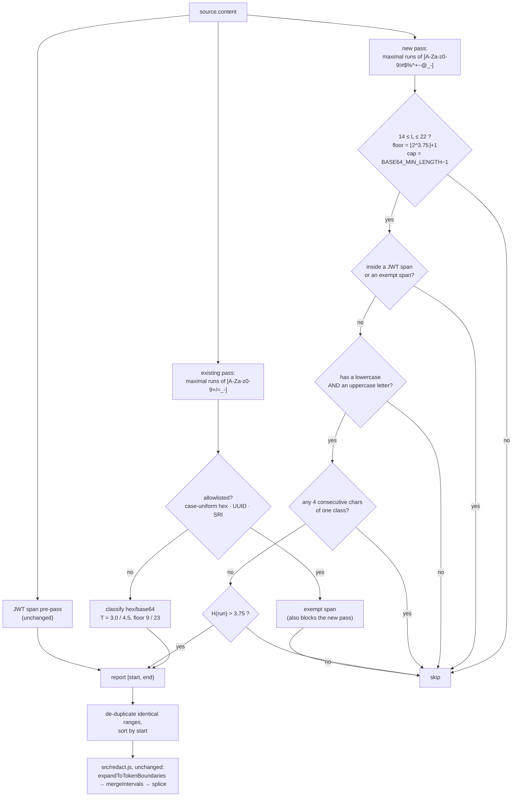

# Design — add-short-password-secret-detection

## Context


See `proposal.md — Why` for motivation. This section records only what shapes the
approach.

**What exists.** `src/entropy-rule.js` scores maximal runs of `[A-Za-z0-9+/=_-]`
against 4.5 bits/char (base64, floor 23) or 3.0 (hex, floor 9), after an anchored
allowlist and a JWT span pre-pass. Both floors are *derived* from their thresholds
(`floor(2**T) + 1`) so the two can never drift. See the archived
`2026-09-09-add-high-entropy-detection/design.md` D3–D6 for that derivation.

**The finding that shapes this whole design.** The proposal's stated mechanism —
mandatory upper+lower letter mix plus a calibrated entropy threshold — is *not
sufficient at these lengths*, and no choice of threshold rescues it. Shannon
entropy over a string's own distribution is a **distinct-character-count** measure:
for a string of length `L` whose characters are all distinct, `H = log2(L)` exactly,
the maximum achievable. Real mixed-case identifiers reach that ceiling at every
length in the target window — measured, not assumed: `NoRedact` and `Duplex$1` at
`log2 8`; `parseSync$1` and `lastIndexOf` at `log2 11`; `Configurable` and
`rgbToAnsi256` at `log2 12`; `rightHandSymbols` and `validE164Numbers` at
`log2 16`; `$ZSFCheckDuration` at `log2 17`. A random password of the same length
has *the same* entropy. Any threshold low enough to detect a 12-character password
also flags `Configurable`. This is not a calibration problem to be solved by picking
a better number — the signal is absent. The design's central job is therefore to add
the **one further predicate** that restores separation, and to justify it with
evidence (D4).

**Corpus used for every measurement below** — the evidentiary base, since no
external standard exists: this repository's `src/`, `test/`, `README.md` and
`openspec/`; its 70 `node_modules` packages; opencode's full documentation site;
and ~45 agent skill Markdown files. Extraction: unique maximal runs of the candidate
charset, length 8–22, containing at least one lowercase **and** one uppercase letter
— **52,501** distinct candidates, of which **6,429** come from hand-written
(non-minified, non-generated) files.

**User decisions taken as given** (confirmed this session; not re-litigated): a
separate additive path inside the same rule module, never lowering the existing
23/9 floors or the 4.5/3.0 thresholds; an expanded password-shaped charset; a
nominal 8–22 length window; a *mandatory* upper+lower letter precondition that is
not on its own sufficient; a separately-derived entropy threshold on top of it; and
precision strongly favoured over recall.

## Goals / Non-Goals


**Goals**

- Detect a generated password/credential shorter than the existing 23-character
  base64 floor, including one containing punctuation the existing tokenizer treats
  as a run separator.
- Leave the existing detection path byte-identical in behaviour: same charset,
  thresholds, floors, allowlist and JWT handling.
- Make every constant *derived* rather than invented, and every fixture's entropy
  exact and hand-checkable — the evidentiary standard the prior change set.
- Keep `test/redact-baseline.test.js` passing with zero baseline edits.
- State the residual false-negative profile honestly enough that nobody mistakes
  this path for comprehensive password detection.

**Non-Goals**

- Detecting human-chosen, word-based passwords (`Hunter2024!`) — indistinguishable
  from words by any measure available here (see Risks).
- A dictionary, word list or n-gram model: unbounded maintenance surface, a new
  dependency, and per-scan cost on a hot path. Rejected under YAGNI.
- A separate config toggle, configurable thresholds, or a user-editable charset.
  `disableHighEntropy` already disables the whole entropy bundle.
- Any change to `redact.js`, `prescreen.js`, `secretlint.js`, `config.js` or
  `index.js`. This change is confined to `src/entropy-rule.js`, tests and docs.

## Decisions

### D1 — Why a new threshold is mandatory, not merely preferable

The existing base64 threshold cannot be reused, for a reason that needs no
judgement: `H ≤ log2(L)`, and `log2(22) = 4.459 < 4.5`. **The 4.5 threshold is
mathematically unreachable at every length in the 8–22 window.** Reusing it would
produce a dead branch. Reusing the hex threshold (3.0, floor 9) at this charset
would flag essentially every capitalised English word of 9+ characters
(`Wonderful` = `log2 9` = 3.170 > 3.0). A separately derived number is forced.

### D2 — Tokenization: a second, independent maximal-run pass

| Option | Consequence | Verdict |
|---|---|---|
| **A.** Widen `CANDIDATE_RUN_PATTERN` itself and reclassify per run. | One tokenizer, but it changes the *existing* path's run boundaries: `a8Fk…!` would merge with neighbouring text, so base64/hex runs, their lengths, and therefore their measured entropy all shift. The existing thresholds were calibrated against the current boundaries. Directly contradicts "no change to the existing path". | **Rejected.** |
| **B.** A second maximal-run pass with its own charset (`findPasswordCandidateRuns`), scored by its own predicate chain. | Existing tokenizer untouched; the two passes are independent and separately unit-testable; overlap is handled downstream (D6). Costs one extra O(n) regex scan. | **Chosen.** |
| **C.** Post-hoc widening of existing runs by absorbing adjacent password punctuation. | All of B's cost plus a hybrid boundary rule that is hard to state and harder to test. No benefit. | **Rejected.** |

Maximal runs are pairwise disjoint *within* each pass, exactly as before. Runs from
the two passes may partially overlap; D6 handles that.

### D3 — The password-shaped character set

**Included — 72 characters:** `A`–`Z`, `a`–`z`, `0`–`9`, and the ten symbols
`!` `#` `$` `%` `^` `+` `-` `_` `~` `@`.

Pattern: `/[A-Za-z0-9!#$%^+~@_-]+/g`.

A symbol is included only if it is common in generated passwords **and** is not a
pervasive structural joiner in code, prose or Markdown. Adding a symbol has two
effects — it lets a password containing it survive as one candidate, and it stops
splitting everything else — so each exclusion is justified by measured damage:

| Excluded | Why (measured in the corpus) |
|---|---|
| `*` | Markdown emphasis glues to words (`**Chosen`, `CommonMark**`), glob, comment markers — and it is in this plugin's own `***REDACTED:…***` placeholder, so including it would let redacted output re-tokenize into new candidates. |
| `?` | TypeScript optional marker and optional chaining (`configPath?`), query-string separator, sentence-final punctuation. |
| `=` `&` | The two most syntactically load-bearing symbols in minified JS, `.env` files and query strings (`ye=fe&&1===Z`, `debounceAccept=-1`). Dominant false-positive contributors, and they buy little: the value beside a `key=` is almost always below the derived floor on its own. |
| `.` `,` `:` `;` | Sentence punctuation, decimals, member access, `key:value`, statement terminators. Both false-merge (prose word + period) and false-split risk. |
| `/` `\` | Path separators, regex delimiters, escapes. Excluding `/` is what makes a lockfile `integrity` digest fragment — closed structurally in D6, not by charset. |
| `"` `'` `` ` `` | String and Markdown-code delimiters. |
| `<` `>` `(` `)` `[` `]` `{` `}` `\|` | Markup, grouping, and pipes/table cells in every language and in Markdown. |

Two consequences worth pinning:

- `-` and `_` **are** included, which keeps a UUID a single 36-character run (out of
  range) rather than five fragments, and keeps an SRI hash a single run.
- Because `*` and `:` are both excluded, `***REDACTED:high-entropy***` tokenizes
  into `REDACTED` (no lowercase) and `high-entropy` (no uppercase). Neither can
  satisfy the case-mix precondition: **redaction output is provably idempotent
  under this path.**

### D4 — Preconditions: case mix, *and* a character-class run cap

The case-mix precondition alone is not sufficient — that is the Context finding.
The added predicate is deliberately the cheapest one that restores separation:

> **A candidate is rejected if it contains four or more consecutive characters of
> the same character class** (lowercase / uppercase / digit / symbol).

Rationale: identifiers and words are built from *syllable-length same-class runs*
(`Config`, `urable`, `Path`), while a generated password alternates classes at
nearly every position. This is a structural property, orthogonal to entropy, and it
costs one anchored regex test.

**Measured effect** (52,501 candidates → survivors):

| Cap | Survivors | Highest length at which a real all-distinct identifier still survives |
|---|---|---|
| none | 52,501 | ≥ 17 (`$ZSFCheckDuration`) |
| ≤ 4 | 8,481 | 15 (`fileURLToPath$1`, `skipIfOlderThan`, `XorShift128Plus`, `Npmrc_authToken`) |
| **≤ 3** | **3,317** | **13** (`$ZodBase64URL`, `$ZodBigIntDef`) |
| ≤ 2 | — | rejects an estimated 75 % of random passwords at L=16; too aggressive |

A cap of 3 pushes the false-positive frontier down to length 13, which is what makes
a workable threshold possible at all (D5). A cap of 4 would force the threshold up
to `log2 15` and the floor to 16, losing two lengths *and* tolerating fewer repeats
at every length — strictly worse. Cap = 3 is chosen.

| Option | Verdict |
|---|---|
| Case mix + entropy only (the literal proposal). | **Rejected** — the only threshold that excludes 13-character all-distinct identifiers under this option is ≈ 4.2, which derives a floor of **19**. That yields four usable lengths below the existing 23 floor and misses every 12–18-character password: the change would deliver almost nothing. |
| Require ≥ 3 character classes (digit or symbol mandatory). | **Rejected** — contradicts the user's "digits and symbols are optional", *and* does not work: `$ZodEnum`, `parseSync$1`, `Duplex$1`, `Config$1` are all-distinct three-class identifiers. |
| Class-transition *density* (count class changes, normalise by length). | **Rejected** — strictly more computation and a second calibrated constant, for a signal the run cap already captures at the lengths that matter. |
| **Case mix + class-run cap (≤ 3) + entropy.** | **Chosen.** Three cheap, orthogonal, independently testable predicates. |

The class-run cap is also how this design satisfies the user's "the rule should
account for the presence of digits and symbols somehow" without making them
mandatory: their presence is what *breaks up* long letter runs, so a candidate
containing them passes the cap far more easily — a bonus signal, not a requirement.
`aB1mcD3NeF5mgH7NiJkL` (D8, P3) contains no symbols at all and is still reported.

### D5 — Threshold 3.75, and the two derived length bounds

**Admissible interval, derived from measurement.** The threshold must

1. reject the highest-entropy *identifier* that survives D4 — all-distinct at
   length 13, `H = log2 13 = 3.7004397181`; and
2. accept an all-distinct candidate at length 14, `H = log2 14 = 3.8073549221`.

So `T ∈ [3.7004397181, 3.8073549221)`. The interval's midpoint is 3.7539. **`T = 3.75`**
is chosen: it is (to two decimals) the midpoint, hence the value furthest from both
failure modes, and it is a round number a reader can check.

**Lower bound, derived not invented.** `H ≤ log2(L)`, so `H > T` requires `L > 2^T`:

```
2 ** 3.75            = 13.4543426759
SHORT_MIN_LENGTH     = Math.floor(2 ** SHORT_THRESHOLD) + 1   // 14
```

The nominal 8-character floor in the proposal is therefore **not delivered**:
lengths 8–13 remain *eligible* but are mathematically unreachable, because
`log2 13 = 3.700 < 3.75`. This is stated plainly rather than papered over — see
Risks. Writing `8` as a separate constant would create exactly the drift the
existing module's `floor(2**T)+1` idiom exists to prevent.

**Upper bound, also derived.**

```
SHORT_MAX_LENGTH = BASE64_MIN_LENGTH - 1                       // 22
```

Tying the cap to the existing base64 floor (rather than hard-coding 22) states the
real reason for it: **above 22 the base64 path owns the decision, and this path's
lower threshold must not silently override the calibrated 4.5.** Without the cap, a
40-character mixed-case base64 run that the existing path deliberately rejects at
4.5 would be reported at 3.75 instead — a behaviour change nobody asked for, on the
content class most likely to appear in tool output.

**A single flat threshold, not a graduated table.** Because the class-run cap
flattens the false-positive frontier to a single length (13), the frontier does not
move with `L`, so a length-graduated threshold has nothing to track. A deficit form
(`H > log2(L) − δ`) was considered and rejected for the same reason: it is a second
constant that reproduces `T = 3.75` over the whole window while being harder to
verify by hand. YAGNI.

**Entropy arithmetic used throughout.** For a candidate of length `L` in which `r`
characters occur exactly twice and the rest once:

```
H = log2(L) − 2r/L
```

(`r = 0` gives the all-distinct ceiling `log2 L`.) Every fixture in D8 is built from
this identity or from the uniform-multiset identity `H = log2(k)`.

**Measured outcome of the complete rule.**

| Stage | Full corpus | Hand-written files only |
|---|---|---|
| mixed-case candidates, length 8–22 | 52,501 | 6,429 |
| after class-run cap ≤ 3 | 3,317 | 92 |
| after derived floor `L ≥ 14` | 529 | **2** |
| after `H > 3.75` | — | **1** |

The single hand-written-corpus finding is `ZQ7mK4pXvB2nJ8wR5tL9cF` — this
repository's own SendGrid secret fixture. The other survivor,
`aGVsbG8gd29ybGQ` (base64 of "hello world", `H = 3.4565647`), is correctly rejected
by the threshold. **One finding, one true positive, zero false positives across
6,429 hand-written candidates.** Across the full corpus the residual false positives
are almost entirely minified bundles, generated Lezer parser tables and SVG path
data — the same dense-token-soup class the existing path already redacts and
already documents.

### D6 — Interaction with the existing path

**Allowlist.** The three existing shapes need no re-application as *run predicates*,
and this was verified rather than assumed:

| Shape | Why it cannot reach the new path |
|---|---|
| Case-uniform hex (7–12, 32, 40, 64, 128) | "Case-uniform" means letters are all lowercase (`a`–`f`) or all uppercase (`A`–`F`). Such a run can never contain both a lowercase **and** an uppercase letter, so it fails the mandatory precondition structurally, at every length. |
| UUID | `-` is in the new charset, so a canonical UUID is a single 36-character run — above `SHORT_MAX_LENGTH`. |
| SRI hash | `-` and `+` are in the new charset and real digests are 28+ characters, so the prefixed form is a single out-of-range run — **except** that `/` is *not* in the new charset (D3), so a digest containing `/` fragments. A 14–22-character mixed-case fragment of a lockfile `integrity` value would otherwise be reported, re-introducing per-dependency redaction of `package-lock.json`. |

That last row is a real gap and is closed structurally: **the new path skips any
candidate contained in a span that the existing path allowlisted.** Those spans are
`findCandidateRuns(text)` filtered by `isAllowlistedRun` — under the *existing*
charset `/` is included, so an SRI is one run there and the whole digest becomes an
exempt span. This reuses the existing `isWithinAnySpan` helper, generalises to any
future allowlist shape, and needs no new predicate. D8 N8 pins it.

**JWT.** The new path also skips candidates inside a JWT span. Required, not
cosmetic: the existing spec guarantees a JWT's header and payload are *never*
reported on their own account, and a short payload (`eyJhIjoxfQ`) or a 14–22
character signature would otherwise break that guarantee and double-report.

**The mixed-case-hex question, answered.** Lengths 8–12 do overlap the existing
case-uniform exemption range 7–12, and a *mixed-case* hex run there is indeed not
covered by that exemption. But it is already scored by the existing hex path
(threshold 3.0, floor 9) and is therefore already detected today at lengths 9–12;
at length 8 it is below the existing hex floor and also below this path's derived
floor of 14. **No new gap, and no new double-report below length 14.**

**Overlap and de-duplication.** At lengths 14–22 a run may be evaluated by both
paths (e.g. mixed-case hex). Three cases:

- *Identical ranges* — de-duplicated inside `findHighEntropyFindings` before it
  returns, so the function keeps a clean contract (one finding per distinct range)
  and `redactionCount` is not inflated.
- *Partially overlapping ranges* (the charsets differ, so run boundaries can differ)
  — merged downstream by `mergeIntervals` into one interval with one placeholder.
  Note this means findings are **no longer pairwise disjoint**; the existing spec
  never required disjointness, so no requirement is contradicted, but the delta spec
  should state the new invariant explicitly.
- *Disjoint ranges* — two independent findings, which is correct.

**Predicate order** is by cost and selectivity: length window → case mix →
class-run cap → entropy. The first three are anchored regex/length tests; only the
last allocates.

### D7 — Rule identity: one `ruleId`, one message

| Option | Verdict |
|---|---|
| **Keep `ruleId: "high-entropy"`, one `messageId`, one constant message.** | **Chosen.** The placeholder label is the only user-visible artefact and `high-entropy` stays accurate — the new path is still an entropy test. D6 of the prior change (constant message, `data` left `undefined` to sidestep the `maskSecrets` string-replacement trap) is unchanged and still binding. |
| A second `messageId` within the same rule. | **Rejected** — this plugin never surfaces secretlint message text, only ranges and rule ids, so it buys nothing observable. YAGNI. |
| A distinct rule id (`short-secret`) with its own config entry. | **Rejected** — produces composite placeholders like `***REDACTED:high-entropy+short-secret***` on a single token, fragments the label vocabulary, changes `createEntropyConfig`, and breaks `test/secretlint.test.js`'s rule-count assertion for a diagnostic nobody has asked for. |

Diagnosability trade-off: with one label, an in-the-field false positive does not
say which path fired. Mitigated by exporting the new predicates as named pure
functions, so a reported string is diagnosed by calling them directly.

### D8 — Verified fixtures

Same standard as the prior change's D9: no vendor exists to verify against, so every
fixture is **constructed so its Shannon entropy is exact and hand-checkable**, using
`H = log2(L) − 2r/L` or `H = log2(k)`. Entropy is order-independent, so characters
are arranged to satisfy (or deliberately violate) the class-run cap without changing
the value. Every fixture is chosen so the **existing** path cannot fire on it, so
each asserted finding provably comes from the new path.

| # | Fixture | L | Construction | `H` (exact) | Expected |
|---|---|---|---|---|---|
| P1 | `aB3!cD7#eF2$gH` | 14 | all distinct; classes cycle low/up/dig/sym | `log2 14` = **3.8073549221** | reported — pins the derived floor from above |
| P2 | `aB1!cD2#eF3$gH4%iJ5^kL` | 22 | all distinct | `log2 22` = **4.4594316186** | reported — top of the window |
| P3 | `aB1mcD3NeF5mgH7NiJkL` | 20 | 18 distinct, `m` and `N` twice (`r = 2`) | `4.3219280949 − 0.2` = **4.1219280949** | reported — proves repeats are tolerated **and** that symbols are not required (this fixture has none) |
| N1 | `aB3!cD7#eF2$g` | 13 | all distinct | `log2 13` = **3.7004397181** | not reported — one character shorter than P1; pins the floor from below |
| N2 | `aBc3!DeF7#gH2$aB` | 16 | 14 distinct, `a` and `B` twice (`r = 2`) | `4 − 0.25` = **3.75 exactly** | not reported — pins `>` rather than `>=` |
| N3 | `Ab1!` repeated 4× | 16 | uniform multiset, `k = 4` | `log2 4` = **2.0** | not reported — length ≥ 14 proves it was *scored*, not length-skipped |
| N4a | `a1!b2#c3$d4%e5^f` | 16 | all distinct, **no uppercase** | `log2 16` = **4.0** | not reported — isolates the case-mix precondition |
| N4b | `A1!b2#c3$d4%e5^f` | 16 | N4a with `a` → `A` | `log2 16` = **4.0** | reported — identical length *and* identical entropy to N4a, so case mix is provably the only discriminator |
| N5 | `acegikBDFHJL12345!#$%^` | 22 | **the same multiset as P2**, re-ordered into same-class blocks | `log2 22` = **4.4594316186** | not reported — identical length and entropy to P2, so the class-run cap is provably the only discriminator |
| N6 | `getFileUrlFromFullPath` | 22 | real identifier: `l`×4, `F`×3, `e`/`t`/`r`×2, 9 singles (14 distinct) | **3.6069366** | not reported — passes charset, length, case mix **and** the run cap; rejected by the threshold alone |
| N7 | `rightHandSymbols` | 16 | real identifier, all distinct | `log2 16` = **4.0** | not reported — passes charset, length, case mix and the threshold; rejected by the run cap alone (`right` is 5 lowercase) |
| N8 | `sha256-XY/aB1cD2eF3gH4iJ/ZW==` | — | SRI whose digest fragments at `/` into a 14-character all-distinct run (`H` = 3.8073549221) | — | not reported — pins the allowlisted-span exclusion of D6 |
| N9 | `aGVsbG8gd29ybGQ` | 15 | base64 of "hello world": `G`×3, `b`×2, 10 singles (12 distinct) | **3.4565647** | not reported — real base64 data below the threshold |

`H` for N6 and N9 is `−Σ pᵢ log2 pᵢ` over the stated multiset; both are reproducible
by hand from the counts given. Assertions match `shannonEntropy` to within `1e-9`,
as the existing entropy tests do.

**Where the fixtures live.** Append to the existing `ENTROPY_FIXTURES` export rather
than creating a second array. That array is already consumed by two loops that give
the new cases end-to-end coverage for free — the `expectFinding` loop in
`test/entropy-rule.test.js`, and `test/index.test.js`'s
"leaves every allowlisted fixture unredacted" loop, which asserts `toBe(content)`
for every `expectFinding: false` entry. Every negative above is anchor-free, so the
anchored bundle is prescreen-skipped and that stronger assertion holds.
`RULE_FIXTURES` stays untouched (it is one entry per *anchored* rule and feeds the
frozen baseline).

### D9 — Why no existing test changes


- **`test/redact-baseline.test.js` is structurally immune.** It builds its linter
  from `createLinter(createSecretlintConfig())` — the anchored preset bundle only
  (verified at lines 34–35 of that file, not assumed). The entropy bundle never runs
  in the baseline, so no entropy change can move it.
- **Existing `ENTROPY_FIXTURES` negatives stay negative**, each for a structural
  reason: the three repeated-alphabet fixtures and the two case-uniform hex fixtures
  contain no case mix; the UUID is a single 36-character run; the SRI is covered by
  the D6 span exclusion; the unsigned JWT's segments are 35 and 27 characters and
  sit inside a JWT span.
- **The base64-positive fixture** (36 distinct symbols from `[0-9a-z]`) has no
  uppercase, so `test/index.test.js`'s single-placeholder expectations are unmoved,
  as is the JWT placeholder-count assertion (the new path skips JWT spans).
- **`test/index.test.js` asserts labels with `toContain("***REDACTED:")`** in the
  `RULE_FIXTURES` loop, so a fixture that newly also matches this path — the
  SendGrid fixture's 22-character segment will — still passes.

## Diagram

Per-candidate decision for the new path, and how it composes with the existing one:



## Behavioural requirements implied by this design

For the engineer to transcribe into `openspec/changes/.../specs/` as **ADDED**
requirements on `high-entropy-secret-detection`. This document does not write
`openspec/specs/`.

- A substring drawn from the password-shaped character set is reported as a
  candidate secret only when **all four** hold: its length is within the path's
  window; it contains at least one lowercase **and** at least one uppercase letter;
  it contains no four consecutive characters of the same character class
  (lowercase / uppercase / digit / symbol); and its Shannon entropy strictly exceeds
  the path's threshold. Failing any one of the four means it is not reported.
- The window's lower bound is the smallest length at which the threshold is
  mathematically achievable, and its upper bound is one below the base64 path's
  minimum length, so the two paths never contend for the same decision.
- A candidate exactly at the threshold is not reported.
- The password-shaped path never reports a substring inside a JWT-shaped span, nor
  inside a span the existing allowlist exempted — so a Subresource-Integrity digest
  remains fully exempt even when the password-shaped tokenizer would fragment it.
- The existing base64/hex path, its thresholds, its length floors and its allowlist
  are unchanged; the new path is purely additive.
- Findings from the two paths may overlap; identical ranges are reported once, and
  overlapping ranges are merged into a single redaction placeholder by the existing
  pipeline.
- Both paths report under the same rule id, so the placeholder label is unchanged.
- The finding message still never contains the matched value.

## Risks / Trade-offs


- **Lengths 8–13 are not detected, despite the proposal's stated 8-character
  floor.** `log2 13 = 3.700 < 3.75`, so the window is effectively 14–22. → No
  mitigation exists: at those lengths real identifiers sit *at* the entropy ceiling
  (`Configurable`, `$ZodBase64URL`), so any threshold reaching them floods output.
  Document in the README as a deliberate limit, not a bug.
- **Recall is modest even inside 14–22.** A random 16-character password over a
  72-symbol alphabet typically has ~14–15 distinct characters (`H ≈ 3.75–3.88`) and
  has roughly a 36 % chance of containing a 4-run, so a substantial fraction is
  missed; detection improves markedly at 19–22. → Accepted: precision over recall
  was chosen explicitly. Quantified here so the trade is visible, not implied.
- **Word-based human passwords (`Hunter2024!`) are essentially never detected** —
  short, with a long lowercase word core. → Out of reach by design; the anchored
  `basicauth` / `database-connection-string` rules still cover credentials in URLs.
- **A 23+ character password containing excluded punctuation is detected by neither
  path.** `Xy7!kQ2mZpAbCdEfGhIjKlM` fragments below the base64 floor on the existing
  path and exceeds `SHORT_MAX_LENGTH` on the new one. → A confirmed blind spot,
  accepted here because removing the cap would let 3.75 override the calibrated 4.5
  on long base64 runs (D5). Recorded so a future change can revisit it deliberately.
- **The calibration is empirical, not standards-based.** The interval
  `[log2 13, log2 14)` is forced by one specific corpus; a Java or Go corpus could
  place the frontier elsewhere. → Revisit triggers, stated so the number is
  falsifiable: if identifier-shaped false positives appear in the field, lower the
  class-run cap to 2 before raising the threshold (the cap is the sharper
  instrument); if real 14–18-character secrets are reported as missed, the threshold
  cannot go below `log2 13` without re-admitting `Configurable`-class identifiers,
  so the correct response is a different signal, not a different number.
- **Minified bundles, generated parser tables and dense base64 remain false
  positives** — 529 candidates reached the entropy stage across the full corpus,
  almost all from such files. → Unchanged in kind from the existing path's already
  documented charset-constant behaviour; this change sharpens it.
  `disableHighEntropy` remains the escape hatch, and `noredact` covers user messages.
- **Over-redaction on dense single-line content is further amplified**, since a
  finding still expands to whitespace boundaries. → Same mitigation as before;
  document as a sharpened form of an existing limitation.
- **This document and `test/entropy-fixtures.js` will themselves be partially
  redacted when read back through the plugin**, because the D8 fixtures are
  high-entropy by construction (already true of the prior change's design.md). →
  Construct fixtures in code from the D8 table rather than by copying a redacted
  read, and do not mistake a placeholder for file content.
- **`.secrets.baseline` may need refreshing** if the pre-commit `detect-secrets`
  hook flags the new fixtures. Expected — they are secret-shaped by design.

## Migration Plan

Ordering matters only in that step 4 must follow steps 1–3.

1. `src/entropy-rule.js`: add the pure helpers and their derived constants —
   `PASSWORD_RUN_PATTERN`, `findPasswordCandidateRuns`, `hasMixedLetterCase`,
   `hasLongCharacterClassRun` (its `{n}` quantifier built from `MAX_CLASS_RUN + 1`
   so the two cannot drift), `SHORT_THRESHOLD = 3.75`,
   `SHORT_MIN_LENGTH = Math.floor(2 ** SHORT_THRESHOLD) + 1`,
   `SHORT_MAX_LENGTH = BASE64_MIN_LENGTH - 1`. Export each so the arithmetic is
   unit-testable without the engine.
2. Append the D8 fixtures to `ENTROPY_FIXTURES`; add unit tests asserting each
   stated entropy to `1e-9`, plus the two discriminator pairs (N4a/N4b, P2/N5).
3. Wire the second loop into `findHighEntropyFindings`: build the exempt-span list
   (JWT spans plus allowlisted existing-path runs), apply the predicate chain in
   cost order, de-duplicate identical ranges, keep the existing sort.
4. Run the full suite. `test/redact-baseline.test.js` must pass with **zero**
   baseline edits; if it does not, this change is wrong, not the baseline.
5. Delta spec (`## ADDED Requirements` only, per the proposal) and README: the new
   path, its charset, its effective window, and its accepted blind spots.
6. Refresh `.secrets.baseline` if `detect-secrets` flags the new fixtures.

Rollback is unchanged and total: `disableHighEntropy: true` disables both paths, or
remove the plugin symlink and restart. No persisted state, no data migration.

## Component Breakdown

| Component | Work kind | Done when |
|---|---|---|
| Password-shaped tokenizer | Application code (JS ESM) | `findPasswordCandidateRuns` returns maximal, pairwise-disjoint runs of exactly the 72-character set in D3; a `***REDACTED:…***` placeholder yields no candidate satisfying the case-mix precondition. |
| Precondition predicates | Application code (JS ESM) | `hasMixedLetterCase` and `hasLongCharacterClassRun` behave per D4; the run-length quantifier is derived from `MAX_CLASS_RUN`, not written twice; N4a/N4b and P2/N5 discriminate as stated. |
| Derived constants | Application code (JS ESM) | `SHORT_MIN_LENGTH` evaluates to 14 from `SHORT_THRESHOLD`, `SHORT_MAX_LENGTH` to 22 from `BASE64_MIN_LENGTH`; neither 14 nor 22 appears as a literal. |
| Orchestration in `findHighEntropyFindings` | Application code (JS ESM) | Both paths run; the new path skips JWT spans and allowlisted spans; predicates apply in cost order; identical ranges appear once; output stays sorted by start; the existing path's behaviour is byte-identical. |
| `ENTROPY_FIXTURES` additions + tests | Test code (vitest) | One case per D8 row; every stated entropy reproduced to `1e-9`; end-to-end coverage through both hooks for one positive; `RULE_FIXTURES` untouched. |
| Regression guards | Test code (vitest) | N6 and N7 asserted as permanent non-findings, so a future threshold or cap change that re-admits identifier-shaped strings fails loudly. |
| Delta spec | Documentation (OpenSpec) | ADDED requirements per the section above; `openspec validate` clean. |
| README | Documentation | New path, its charset, its effective 14–22 window, the 8–13 and 23+-with-punctuation blind spots, and the precision-over-recall stance stated as deliberate. |

## Open Questions

Deferrable without changing the specs, the approach, or the breakdown:

1. **The field false-positive rate on minified and generated content.** The corpus
   measurement stands in for it, but only real usage settles whether 529 whole-corpus
   candidates translate into user-visible noise. The revisit triggers in Risks say
   what to change in either direction.
2. **Whether `detect-secrets` flags the D8 fixtures** at commit time. Expected;
   resolved by running the hook, not by reasoning about it.
