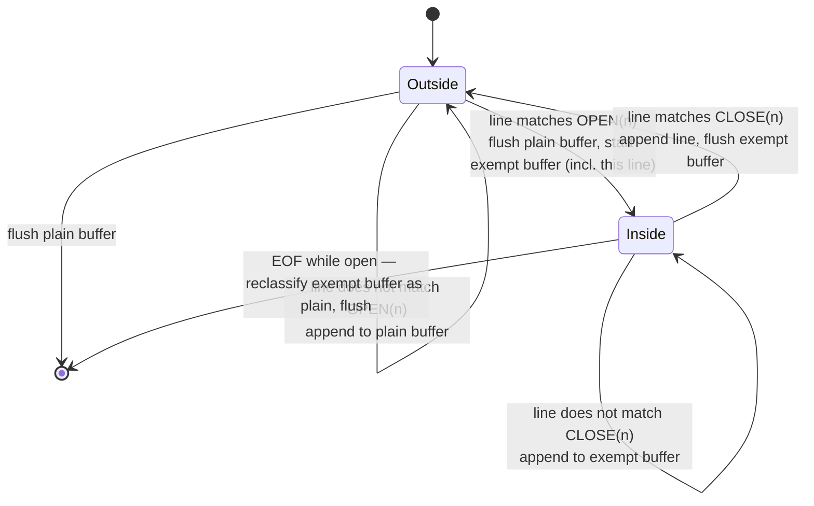
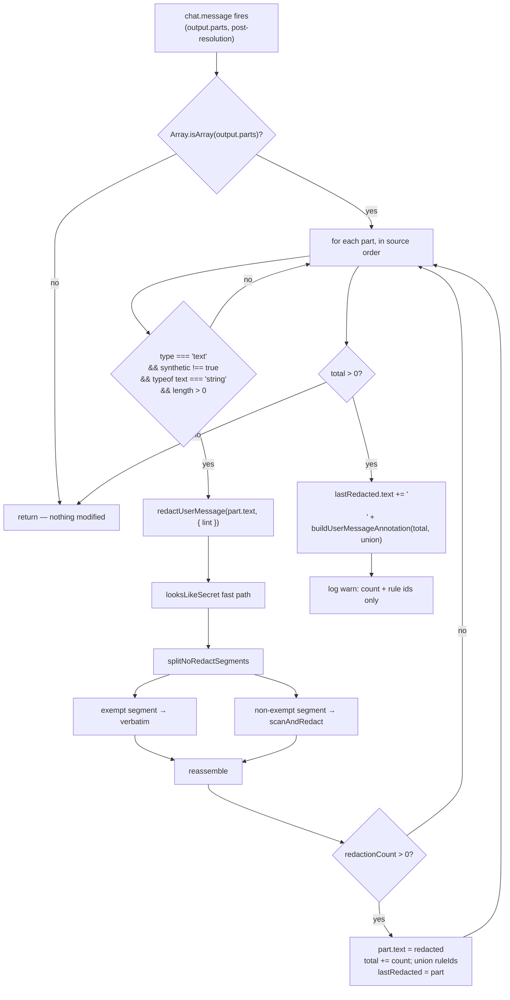

# Design — add-user-message-redaction

## Context

`opencode-redact` today scans one thing: the `output.output` string of a successful
tool call, via `tool.execute.after`. A user who types or pastes a secret into their
own chat message is not scanned at all — the secret reaches the model and the
persisted transcript in the clear.

This change adds a second entry point (`chat.message`) over the *same* detection
engine, plus a deliberate opt-out (the ` ```noredact ` fence) so a user can send
content they know is safe without fighting a false positive.

**Verified platform facts** (read from the opencode source at
`packages/opencode/src/session/prompt.ts` and `packages/plugin/src/index.ts` on
2026-09-09 — not asserted from training data):

- Hook signature: `"chat.message"(input: { sessionID, agent?, model?, messageID?, variant? }, output: { message: UserMessage, parts: Part[] }) => Promise<void>`.
- The hook fires at `prompt.ts:999` **after** part resolution, and the same array
  object (`resolvedParts`) is consumed downstream at `prompt.ts:1011`. **Mutating
  `part.text` in place is therefore effective**, exactly as `output.output = …` is
  in the existing tool hook.
- `Plugin.trigger` invokes each hook through `Effect.promise(...)`
  (`packages/opencode/src/plugin/index.ts:294`). `Effect.promise` converts a
  rejection into a **defect**, not a typed failure — an unhandled throw here dies
  the fiber and aborts the whole user turn, it does not merely skip redaction.
  This is the concrete reason the never-throw requirement is harder here than in
  `tool.execute.after`.
- `synthetic: true` is set by opencode on expanded `@file` mentions, directory
  listings, decoded pastes, plan/reminder injections, and the task-tool subagent
  prompt (`prompt.ts:447,485,711–983`, `tool/task.ts:240`, `session/reminders.ts`).
  Filtering on it is a real, load-bearing signal, not a heuristic.

## Goals / Non-Goals

**Goals**

- Scan non-synthetic, `text`-type parts of an incoming user message with the
  existing secretlint engine and the existing placeholder/merge/expand semantics.
- Give the user a segment-level ` ```noredact ` exemption that is safe by
  construction and never taught to the model.
- Extract the annotation-free detection core (`scanAndRedact`) out of
  `redactSecrets` with **provably** zero behaviour change to tool-output redaction.
- Make "the hook never rejects" a designed, tested property rather than an
  inherited assumption.

**Non-Goals**

- Scanning synthetic parts (attached files, directory listings, decoded pastes,
  subagent prompts). Out of scope by the proposal; documented limitation.
- Any config surface. The fence is an inline textual convention only.
- Honouring the fence anywhere other than a non-synthetic user-message part
  (see D2 — this is a security boundary, not an omission).
- A Markdown parser. The fence grammar is a deliberately tiny line grammar (D4).

## Decisions

### D1 — Function inventory and the annotation seam

`src/redact.js` stays the pure core (no opencode types, no secretlint import,
linter always injected). Four additions plus one refactor:

```
splitNoRedactSegments(text: string)        → Array<{ text: string, exempt: boolean }>
scanAndRedact(text, { lint })              → Promise<{ text, redactionCount, ruleIds }>   // no annotation
redactSecrets(text, { lint })              → Promise<{ text, redactionCount, ruleIds }>   // scanAndRedact + buildAnnotation
redactUserMessage(text, { lint })          → Promise<{ text, redactionCount, ruleIds }>   // fence-aware, no annotation
buildUserMessageAnnotation(count, ruleIds) → string
```

`scanAndRedact` is today's `redactSecrets` body with the final
`` `${redacted}\n\n${buildAnnotation(...)}` `` line removed. `redactSecrets` becomes:
prescreen-and-scan via `scanAndRedact`, return unchanged when `redactionCount === 0`,
otherwise return the same object with `\n\n` + `buildAnnotation(count, ruleIds)`
appended to `text`. This is byte-identical to the current expression by construction.

**Refactor hazard to pin in tests:** `scanAndRedact` must return the *input value
itself* for the non-string / empty / prescreen-negative early exits — not a coerced
string. Today `redactSecrets(undefined, …)` returns `{ text: undefined, … }`, and
the tool hook's `typeof original !== "string"` guard means nothing observable
depends on it — but the baseline (D8) will pin it, so the refactor must not
"tidy" it into `""`.

**Where the annotation is appended — options considered**

| Option | Behaviour | Verdict |
|---|---|---|
| A. `redactUserMessage` appends its own annotation (literal reading of the proposal) | One annotation *per redacted part*. Correct only when the message has exactly one non-synthetic text part. | **Rejected** — silently violates "exactly one annotation per message" on multi-part messages. |
| B. `redactUserMessage(text, { lint, annotate = true })` | Hook passes `annotate: false`; the default is never used in production. | **Rejected** — boolean-trap parameter, two code paths, and the only shipped path is the untested-by-default one. |
| C. `redactUserMessage` is annotation-free; the hook aggregates across parts and appends once | Mirrors the `scanAndRedact` (bare) / `redactSecrets` (annotating) split already established. | **Chosen.** |

Option C is a placement change only, not a scope change: the proposal's behavioural
requirement — *exactly one aggregated annotation per message, covering the total
count and the union of rule ids* — is what ships. Only the *call site* of the
append moves into `src/index.js`, because the hook is the only place that can see
every part. Spec authors should write the requirement at the message level, not
the function level.

### D2 — The fence applies to user messages only

`redactSecrets` (tool output) **does not** call `splitNoRedactSegments` and never
honours the fence. This closes the obvious hole: otherwise any file, command
output, or HTTP response containing a ` ```noredact ` line would exempt itself
from scanning, turning a user convenience into a universal bypass that
attacker-controlled content can trigger.

The trust argument for the user-message side: the fence is honoured only in parts
the *human authored in the composer* (`synthetic !== true`). Content that arrives
from elsewhere — `@file` expansions, directory listings, decoded pastes, subagent
prompts — is synthetic and is neither scanned nor fence-processed in this change,
so it cannot self-exempt.

**Residual, accepted:** a user who pastes a short attacker-supplied blob directly
into the composer, where that blob contains a well-formed `noredact` fence, will
exempt it. The message author is the trust root for their own message; the
alternative (no fence at all) was rejected because false-positive friction on
hashes and checksums is the reason the feature exists. Documented as a limitation.

### D3 — The non-synthetic filter lives in `src/index.js`

`src/redact.js` has no knowledge of opencode's `Part` shape and must keep none —
it is the module the unit suite drives with plain strings and a stub `lint`.
The predicate therefore lives in the hook:

```
part && part.type === "text" && part.synthetic !== true
      && typeof part.text === "string" && part.text.length > 0
```

Two sub-decisions:

- **`synthetic !== true`, not `!part.synthetic`.** Only the literal boolean `true`
  excludes a part. Any other truthy value falls through to *being scanned*, which
  is the safe direction for a security control. (opencode's schema only ever
  emits the boolean, so this is defence in depth.)
- **`part.type === "text"` only.** `file`, `agent`, and image parts are skipped —
  `part.text` is absent or not user prose there.

**Rejected alternative:** passing the whole `parts` array into `redact.js` as
`redactUserMessageParts(parts, { lint })`. Rejected because it drags opencode's
part shape into the pure core, forces every unit test to fabricate part objects,
and buys nothing — the loop is six lines.

### D4 — Fence grammar

A minimal *line* grammar, not a Markdown parser. Each decision below picks the
option that is (a) unambiguously testable and (b) fails toward *scanning* when the
input is ambiguous.

**Opening fence line** (with any trailing `\r` ignored for matching):

```
^[ ]{0,3}(`{3,})[ \t]*noredact[ \t]*$
```

**Closing fence line** for an open run of exactly `n` backticks:

```
^[ ]{0,3}`{n}[ \t]*$
```

| # | Ambiguity | Options | Decision & rationale |
|---|---|---|---|
| 1 | Closing-fence length | (a) CommonMark: closer ≥ opener; (b) closer **exactly** = opener | **(b) exact.** Stricter ⇒ more content scanned ⇒ fail-safe. Also gives free nesting escape (case 9) and makes the "unterminated" test case trivial. A 4-backtick opener closed by 3 or 5 backticks is *unterminated*, hence not exempt. |
| 2 | Tilde fences (`~~~noredact`) | (a) support; (b) backticks only | **(b) backticks only.** A second delimiter alphabet doubles the grammar, the test matrix, and the bypass surface for zero user benefit. A `~~~noredact` block is ordinary text and **is scanned**. |
| 3 | Indentation | (a) column 0 only; (b) CommonMark 0–3 leading spaces; (c) any indent | **(b) 0–3 spaces**, allowed independently on the opening and closing line, **spaces only — a leading tab disqualifies the line**. Matches editor/Markdown intuition (e.g. a fence nested in a list item) without opening an unbounded-indent hole. Unlike CommonMark we do **not** de-indent the content: exempt segments are passed through byte-identical (D5). |
| 4 | Info string | (a) exact `noredact`; (b) first-word match allowing extra words; (c) substring | **(a) exact**, after trimming spaces/tabs, ASCII case-insensitive. `NoRedact` and `NOREDACT` match. ` ```noredactx `, ` ```json noredact `, and ` ```noredact json ` are **not** fences and are scanned. Avoids inventing an argument syntax now (YAGNI). |
| 5 | Unicode in the info string | (a) Unicode case folding; (b) ASCII-only | **(b) ASCII-only** — match with a non-`u`-flag regex (or an explicit ASCII compare). Prevents homoglyph/case-folding tricks (e.g. `noredaсt` with a Cyrillic `с`, or the Kelvin sign) from opening a fence. |
| 6 | CRLF | (a) normalise CRLF→LF before processing; (b) preserve terminators | **(b) preserve.** Normalising would rewrite bytes the user never asked us to touch. The scanner strips a trailing `\r` **for matching purposes only**; reassembly concatenates original slices, so a CRLF document round-trips byte-identically. |
| 7 | Multiple fences in one part | — | **Supported.** One left-to-right pass emits any number of alternating segments. |
| 8 | Empty fence body | — | **Valid.** ` ```noredact ` immediately followed by ` ``` ` is an exempt segment whose body is empty. No special case; output equals input. |
| 9 | Closing fence at EOF with no trailing newline | (a) require a newline; (b) EOF terminates the line | **(b).** The last line of a typed message frequently has no trailing newline; requiring one would make a visually-correct fence silently fail. This is the one permissive choice, and it is bounded to the final line. An **opening** fence with no closer at EOF is still **unterminated ⇒ not exempt** (proposal's fail-safe rule). |
| 10 | Nested fences | (a) track nesting depth; (b) no nesting — first valid closer wins | **(b).** The first line matching `CLOSE(n)` ends the block, so a bare ` ``` ` inside a 3-backtick `noredact` block closes it early and the remainder is scanned (safe direction). Users wrap fenced content with a **longer** fence (` ````noredact … ```` `), which works precisely because of decision #1. Document this in the README. |
| 11 | Fence lines themselves | (a) exclude the delimiter lines from the segment; (b) include them | **(b) include.** The exempt segment spans from the first character of the opening fence line through the end of the closing fence line (including its terminator). Keeps offsets contiguous and makes the round-trip invariant (D5) trivially true. Delimiter lines are backticks and a literal keyword — never a secret. |
| 12 | Inline occurrence | — | A fence must start a line (after 0–3 spaces). ` ```noredact ` in the middle of a line is ordinary text. |

**Unterminated-fence handling:** on reaching EOF with a block still open, the
buffered content — *including* the orphan opening fence line — is reclassified as
**non-exempt** and scanned. Nothing is dropped and nothing is exempted.



### D5 — `splitNoRedactSegments` contract

Returns segments in source order. Two invariants, both directly testable and both
worth asserting as properties over the whole fixture corpus:

1. **Round-trip:** `splitNoRedactSegments(t).map(s => s.text).join("") === t` for
   every string `t`. Nothing is normalised, trimmed, de-indented, or re-terminated.
2. **No empty segments:** a zero-length segment is never emitted. Two back-to-back
   fenced blocks therefore yield two *adjacent* `exempt: true` segments — segments
   do not strictly alternate, and callers must not assume they do.

`redactUserMessage` maps over the segments: exempt segments are copied through
untouched; each non-exempt segment goes through `scanAndRedact`; the results are
concatenated in order. `redactionCount` is the sum across segments and `ruleIds`
is their de-duplicated union (sorted, so the annotation label is deterministic
regardless of which segment matched first).

**Latency — the fast path.** `redactUserMessage` runs `looksLikeSecret(text)` on
the **whole part** before splitting, and returns the input unchanged when it is
false. This is sound, not an approximation: every anchor in `looksLikeSecret` is a
plain substring/regex match over the text, so *no anchor in the whole ⇒ no anchor
in any substring*. The overwhelmingly common case — a typed message with no secret
— therefore costs exactly two regex tests and no allocation, and the fence scanner
never even runs. `scanAndRedact` keeps its own per-segment prescreen for the case
where the anchor is inside an exempt segment.

**Worst-case latency, accepted:** a message with `k` non-exempt segments that each
pass the prescreen costs up to `k × 3000 ms` (the linter's per-call timeout).
Options were (a) leave it, (b) add a message-level time budget. **(a) chosen** —
`k > 1` requires the user to have deliberately written a fence *and* the anchor
prescreen to fire on both sides of it; a budget would add a config surface and a
new silent-skip failure mode for a case that does not occur in practice (YAGNI).
Recorded as a known trade-off rather than engineered away.

### D6 — Hook flow, mutation, and annotation placement



- **Mutation:** `part.text = …` in place, mirroring `output.output = …`. Verified
  effective (Context). No part is added, removed, or reordered.
- **Annotation target — options:** (a) the last non-synthetic text part regardless
  of whether it was redacted; (b) **the last part that actually had
  `redactionCount > 0`**. **(b) chosen** — it never mutates an otherwise-clean
  part, and because it is the *last* redacted part, the annotation still lands
  after every placeholder in the message, preserving the ordering guarantee the
  tool-output annotation already makes. (c) injecting a new synthetic part was
  rejected: the hook's contract is mutate-in-place, and fabricating a `Part`
  requires inventing `id`/`messageID`/`sessionID` fields.
- **Separator:** `\n\n`, identical to the tool-output path.
- **Sequential, not parallel:** parts are processed with `for…of` + `await`.
  Concurrency buys nothing (a user message has ~1 non-synthetic text part) and
  would make the per-call timeout budget and the log ordering non-deterministic.
- **Logging:** exactly one `warn` per message, containing the redaction count and
  the short rule ids only — never the matched text, never the scanner message,
  never any part text. The existing `logSafely` helper is reused unchanged.

### D7 — Never-throw design

The requirement is structural, not incidental: `Effect.promise` turns a rejection
into a defect that aborts the user's turn (Context). Three layers:

1. **Outer `try/catch` around the entire handler body**, including the first read
   of `output.parts`. This covers a throwing getter on `output`, a `Proxy`, a
   non-array `parts`, and a `null` `output`.
2. **Inner `try/catch` per part**, inside the loop. This covers a throwing
   `part.type` / `part.text` getter, a frozen or read-only part rejecting the
   `part.text = …` assignment (ESM is strict mode, so that *throws*), and any
   error escaping `redactUserMessage`. **A failing part is skipped and the loop
   continues** — one poisoned part must not suppress redaction of its siblings.
3. **A `try/catch` around the annotation append**, for the same frozen-part reason.
   If the append fails, the redactions already applied stand; only the annotation
   is lost, and the failure is logged.

Every `catch` calls `logSafely(client, "error", …)`, which is itself
try/caught. No `await` sits outside a `try`. The handler always resolves to
`undefined`.

**Fail-open, unchanged:** a scanner error or timeout inside `scanAndRedact`
already returns the original text with `redactionCount: 0`; the part is left
exactly as the user typed it. The user's turn is never blocked by this plugin.

**Rejected alternative:** a single outer `try/catch` only. It satisfies
"never throws" but collapses the whole message on the first bad part, and gives
no signal about *which* part failed. The two-level structure costs three lines.

### D8 — Refactor-safety proof

The extraction of `scanAndRedact` must be proven behaviour-preserving, not
assumed. Mechanism, in execution order:

1. **Corpus.** Add `test/corpus.js` exporting one deterministic list used by both
   sides of the proof: every `RULE_FIXTURES[i].content` (with its `ext`),
   `GCP_JSON_FIXTURE`, and every ad-hoc input currently used in
   `test/redact.test.js` and `test/index.test.js` — clean text, `""`, `undefined`,
   a non-string, multi-finding, overlapping-range, adjacent-in-token,
   partial-range, and malformed-range cases. Stub-linter cases carry their stub
   message list alongside the input so they are reproducible.
2. **Baseline generation — run once, on the pre-refactor tree, before
   `src/redact.js` is touched.** A one-shot script imports the *current*
   `redactSecrets`, runs every corpus entry through it, and writes
   `test/__baseline__/redact-secrets.baseline.json` containing
   `{ input, ext, text, redactionCount, ruleIds }` per entry. Real-linter entries
   pass their `ext` explicitly through a wrapping `lint` (`(t) => realLint(t, { ext })`)
   so `detectExt` is pinned and cannot drift.
3. **Commit the baseline** in the same commit as the corpus, *before* the refactor
   commit, so the git history itself shows it was captured from unmodified code.
4. **Permanent assertion.** A test loads the baseline and, for every entry,
   asserts `deepStrictEqual` of `await redactSecrets(input, { lint })` against
   `{ text, redactionCount, ruleIds }` — byte-identical `text`, identical count,
   and identical `ruleIds` **including array order** (the order is deterministic:
   it derives from merged-interval order, which derives from the sort in
   `mergeIntervals`).
5. **Never regenerate.** The baseline file carries a header comment stating that
   regenerating it destroys the proof. A diff is a regression to fix, not a
   snapshot to update.

**Options considered**

| Option | Verdict |
|---|---|
| Keep a copy of the pre-refactor `redactSecrets` in the repo and diff the two implementations at runtime | **Rejected** — a second copy of the code rots, needs its own tests, and doubles the maintenance surface for a one-time proof. |
| Compare across two git worktrees from a shell script | **Rejected** — not reproducible in CI and not runnable from `npm test`. |
| `expect(...).toMatchSnapshot()` | **Rejected** — `vitest -u` silently rewrites snapshots, so the proof can be erased by a reflex command. An explicit committed JSON + hard `deepStrictEqual` makes any change a deliberate, reviewable diff. |
| Committed JSON baseline + `deepStrictEqual` | **Chosen.** |

## Behavioural requirements implied by this design

For the engineer to transcribe into the `user-message-redaction` delta spec — this
document does not write `openspec/specs/`.

- Non-synthetic `text` parts of an incoming user message are scanned; parts with
  `synthetic === true`, non-`text` parts, non-string `text`, and empty `text` are
  left untouched and are not scanned.
- A detected secret in a scanned part is replaced with the same
  `***REDACTED:<rule>***` placeholder, with the same merge and
  whitespace-expansion semantics as tool output.
- Content inside a well-formed ` ```noredact ` fenced block is passed through
  completely unscanned and byte-identical, while text outside the block in the
  same part is still scanned.
- A malformed or unterminated fence is not exempt; its content is scanned.
- When at least one redaction occurred anywhere in the message, exactly one
  annotation is appended — to the last part that was redacted — reporting the
  total count and the union of matched rule ids. No annotation when nothing was
  redacted.
- The annotation never mentions the `noredact` fence or any way to avoid scanning.
- The hook never rejects, for any input shape or internal failure; on any error
  the affected part is left exactly as authored.
- A scanner error or timeout leaves the part unmodified (fail-open).
- The redaction log entry contains only the count and rule ids — never message
  text, matched secret, or scanner message.
- `redactSecrets` output is byte-identical to its pre-refactor output for the
  entire fixture corpus.

Proposed annotation wording (mirrors `buildAnnotation`'s tone; fence-free by
construction):

> `[opencode-redact] {N} secret(s) in this user message were detected and replaced with ***REDACTED:...*** placeholders (rules: {labels}). A placeholder is NOT the real value and is NOT part of what the user typed. Never write, copy, echo, or commit a ***REDACTED:...*** placeholder into a file, command, or message — doing so would overwrite real content with this marker. Do not attempt to recover, reconstruct, or guess a redacted value; if the task cannot proceed without it, say so and stop.`

Note the deliberate divergence from `buildAnnotation`: the tool-output note says
"ask the user for it", which is wrong here — the user *did* supply it and it was
redacted on purpose. Re-asking would either loop or coach the model toward
soliciting a bypass.

## Risks / Trade-offs

- **Segment splitting suppresses `detectExt`'s JSON branch.** `scanAndRedact` runs
  per segment, and `detectExt` gates the GCP service-account rule on the segment
  parsing as JSON. A fence placed inside a JSON blob leaves neither fragment
  parseable, so the GCP rule cannot fire. Accepted as an explicit known
  limitation, per the user's decision to keep segment-level fences. Note the
  weaker adjacent truth: any user message that mixes prose with a JSON blob
  already fails `JSON.parse` and so already misses that rule — the fence adds one
  more way into a pre-existing gap, it does not create it.
- **Nesting cliff.** A bare ` ``` ` line inside a 3-backtick `noredact` block
  closes it early (D4 #10). The consequence is *more* scanning, never less, and
  the longer-fence workaround must be in the README.
- **Pasted attacker content can carry its own fence** (D2 residual). Accepted;
  the message author is the trust root for their own composer input.
- **Fence semantics diverge from CommonMark** in three places (exact closer
  length, no tildes, no content de-indent). Chosen for testability and fail-safe
  behaviour; must be documented as *this plugin's* grammar, not "Markdown fences".
- **TUI optimistic render.** The composer may render the user's message locally
  before/independently of this hook, so the human may briefly see their own
  unredacted text. Analogous to the existing streaming-preview limitation and
  equally not a model/provider leak — the redacted text is what reaches the LLM
  and the persisted transcript. Document; do not attempt to fix here.
- **Worst-case multi-segment latency** bounded at `k × 3000 ms` (D5). Accepted.
- **Over-redaction on dense single-line input** is inherited unchanged from the
  tool-output path and is now visible on the user's own words, which is more
  jarring. The fence is the mitigation, which is precisely why it exists.

## Migration Plan

Ordering is load-bearing — steps 1–2 must land before `src/redact.js` is edited.

1. Add `test/corpus.js` (D8 step 1).
2. Generate and commit `test/__baseline__/redact-secrets.baseline.json` from the
   **unmodified** `redactSecrets`, plus the assertion test. Suite green.
3. Extract `scanAndRedact`; reduce `redactSecrets` to the annotating wrapper.
   Baseline assertion must pass untouched — no baseline edits permitted.
4. Add `splitNoRedactSegments` with its round-trip and no-empty-segment property
   tests plus the D4 grammar table as the test matrix.
5. Add `redactUserMessage` and `buildUserMessageAnnotation`.
6. Register the `chat.message` hook in `src/index.js` with the D3 filter, the D6
   aggregation, and the D7 error layers.
7. README: new hook behaviour, fence grammar (including the longer-fence nesting
   escape), the non-synthetic-only scope, and the new known-limitation entries.

Rollback is unchanged and total: remove the plugin symlink and restart opencode.
There is no persisted state and no migration of existing data.

## Component Breakdown

| Component | Work kind | Done when |
|---|---|---|
| `scanAndRedact` extraction + `redactSecrets` wrapper | Application code (JS ESM) | `scanAndRedact` returns `{ text, redactionCount, ruleIds }` with no annotation and preserves the non-string early-exit value; `redactSecrets` appends `\n\n` + `buildAnnotation` only when `redactionCount > 0`. |
| `splitNoRedactSegments` | Application code (JS ESM) | Implements the D4 grammar exactly; both D5 invariants hold over the whole corpus; unterminated blocks reclassify as non-exempt. |
| `redactUserMessage` | Application code (JS ESM) | Whole-text `looksLikeSecret` fast path; exempt segments byte-identical; count summed and rule ids unioned across segments; returns no annotation. |
| `buildUserMessageAnnotation` | Application code (JS ESM) | Returns the D-section wording with count and sorted labels interpolated; contains no occurrence of `noredact` and no instruction that could be read as a bypass. |
| `chat.message` hook in `src/index.js` | Application code (JS ESM) | D3 filter applied in the hook; shares the existing `lint`; mutates `part.text` in place; one aggregated annotation on the last redacted part; one `warn` log with count + rule ids only. |
| Never-throw hardening | Application code (JS ESM) | The three D7 `try/catch` layers present; handler resolves to `undefined` for every hostile input shape. |
| Fence grammar test matrix | Test code (vitest) | One case per row of the D4 table, both the accepted and the rejected form; plus CRLF round-trip, multiple fences, empty fence, EOF-without-newline, unterminated, and early-close-by-inner-fence. |
| Never-throw test suite | Test code (vitest) | Missing `parts`, non-array `parts`, throwing `output` getter, throwing `part.type` getter, throwing `part.text` getter, frozen part, and a throwing `lint` each resolve without rejecting and leave input intact. |
| Refactor-safety baseline | Test code (vitest) + one-shot generator | Baseline committed from pre-refactor code; assertion passes post-refactor with zero baseline edits; header comment forbids regeneration. |
| Integration test through the real linter | Test code (vitest) | A message part containing a real fixture secret outside a fence is redacted and annotated; the same secret inside a fence is not; a synthetic part containing it is untouched. |
| README | Documentation | New hook behaviour, the fence grammar and its segment-level semantics, the longer-fence nesting escape, the non-synthetic-only scope, and the four new known limitations (synthetic content unscanned, fail-safe fence handling, TUI optimistic-render gap, `detectExt` suppression by segment splitting). |

## Open Questions

None blocking. The five questions raised in the earlier proposal review — synthetic
scope, fence granularity, annotation content, latency, throw-safety — were decided
by the user and are recorded above as D3, D2/D4, D1/D6, D5, and D7 respectively.
