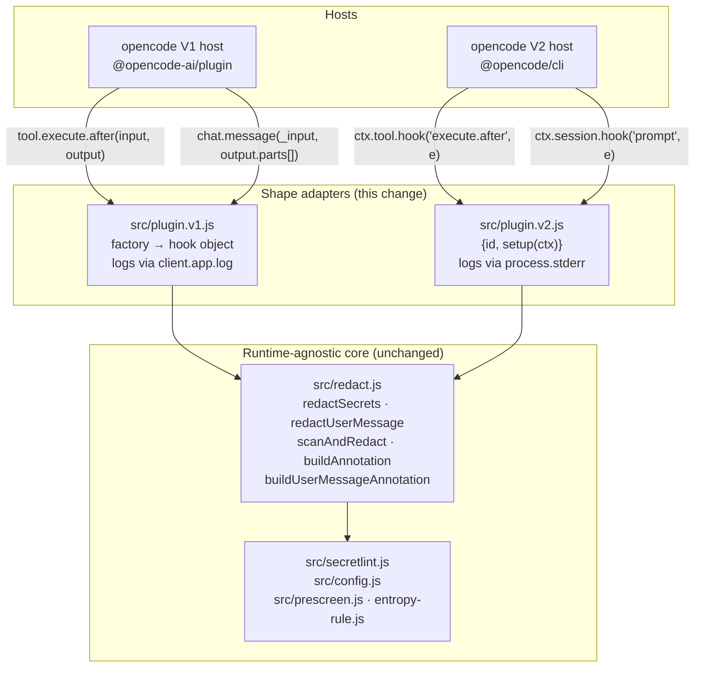

# Design — v2-plugin-migration

## Context

`opencode-redact` ships one adapter today (`src/index.js`) against the legacy V1
SDK (`@opencode-ai/plugin`): a factory that returns a hook object with
`tool.execute.after` and `chat.message`. The real V2 product
(`@opencode/cli` / `@opencode/plugin`) does not run that shape natively — it
runs `{id, setup(ctx)}` and registers hooks imperatively off a context object.
V1 keeps working only through a time-boxed compatibility bridge in the host.

This change adds a second, independent adapter (`src/plugin.v2.js`) beside the
renamed V1 adapter (`src/plugin.v1.js`). A single-file hybrid that satisfies
both shapes at once was tested empirically against real V1 builds in a prior
session and does not work; two entrypoints plus a `package.json` export map is
the design premise, not a decision re-opened here.

The plugin's detection core is already runtime-agnostic. `redact.js`,
`secretlint.js`, and `config.js` take plain strings and injected linters and
know nothing about opencode's shapes. No "core extraction" is in scope — only
two shape adapters over an unchanged core.

### Verified platform facts

Read on 2026-09-16 from the installed `@opencode/plugin` **2.0.4** and
`@opencode/schema` type and JS files (`node_modules/@opencode/plugin/dist/promise/*`,
`node_modules/@opencode/schema/dist/*`). Not asserted from training data.

- **`Plugin.define` is a verbatim identity function** — `plugin.js` is literally
  `export function define(plugin) { return plugin }`. It performs no
  registration, validation, or branding.
- **`Context` has no logger.** `ctx.app` is `{name, version, channel}` only.
  There is no `ctx.app.log`, so V1's `client.app.log({body})` transport has no
  V2 counterpart.
- **Hook registration is asynchronous.** Both `ctx.tool.hook` and
  `ctx.session.hook` are typed `(name, callback) => Promise<Registration>`, where
  `Registration = { dispose: () => Promise<void> }`. The hook is not live until
  the promise resolves.
- **Registrations are also scope-owned.** The Promise→Effect adapter's own
  docstring states: *"Hook registrations created during the async `setup` attach
  to the plugin's scope, so unloading the plugin disposes them."* Explicit
  disposal is therefore defensive, not load-bearing.
- **`tool.execute.after` event shape** —
  `{tool, sessionID, agent, messageID, id, input}` (all `readonly`) intersected
  with `{status:"completed", result: Tool.Result}` | `{status:"error", error: Tool.Error}`.
  The `result` and `error` *bindings* are mutable; `Tool.Result`'s own fields are
  `readonly`:
  `Result = { readonly output?: OutputValue<Output>; readonly content?: string | ReadonlyArray<Content>; readonly metadata?: Metadata }`.
- **`Tool.Content` is a two-member union** — `{type:"text", text}` and
  `{type:"file", uri, mime, name?}`. A file block carries a URI reference, never
  an inline body.
- **The prompt hook event is `SessionPrompt`, not a bare prompt** —
  `{sessionID, messageID, prompt: DeepMutable<PromptInput.Prompt>, metadata?, delivery}`.
  The redactable text is at **`event.prompt.text`**, and `delivery` is
  `"steer" | "queue"` (interrupt-vs-enqueue), not a provenance marker.
- **`PromptInput.Prompt` is `{text, files?, agents?, skills?}`.** `files[]`
  entries are `{uri, name?, description?, mention?}` — **URI references, not
  expanded bodies**. No `synthetic` field exists on this shape.
- **Synthetic content is a structurally separate inbox item.**
  `SessionInbox.Item` is a tagged union over `"user" | "synthetic" | "compaction" | "move"`.
  The `"user"` payload matches `PromptInput.Prompt`; the `"synthetic"` payload is
  a *different* shape, `{text, description?, metadata?}`. `SessionDomain` exposes
  `prompt` and `synthetic` as two distinct API methods.

### Three corrections to the change brief

These were found by reading the installed types and each one changes the design:

1. The prompt text is at **`event.prompt.text`**, not `event.text`.
2. V2 does **not** flatten synthetic content into the prompt hook's text — see
   D4. The brief's premise that the V1 `synthetic !== true` narrowing must be
   abandoned and scope widened is not supported by the type surface.
3. `Plugin.define` is an identity function, which makes a runtime import of
   `@opencode/plugin` avoidable — see D1.

## Goals / Non-Goals

**Goals**

- Run this plugin's existing, unchanged redaction behaviour under V2.
- Keep V1 byte-identical in behaviour; the rename must be the only V1-visible change.
- Keep the two adapters thin: all detection, fencing, splicing, and annotation
  logic stays in `redact.js`.
- Make "the two adapters produce the same redaction outcome" a tested property,
  not an assumption (D9).
- Preserve the existing invariant that no `src/*.js` file runtime-imports a host SDK.

**Non-Goals**

- No detection-engine change. No new rules, no config surface, no placeholder
  or annotation wording change.
- No custom tool registration, so V2's `codemode` tool-visibility problem that
  affected sibling ports is out of scope here.
- No V2 `event.subscribe`, permission, or model hooks — V1 used no generic
  event hook and none is needed.
- No redaction of V2 tool **errors** or **file-attachment bodies** (D6, D4).

## Architecture



Shape mapping, hook by hook:

| Concern | V1 | V2 |
|---|---|---|
| Tool text | `output.output` (always a plain string) | `event.result.content` (`string \| Content[]`), guarded on `status === "completed"` |
| Tool mutation | assign `output.output` | replace `event.result` with a new object (its fields are `readonly`) |
| User text | `output.parts[]`, filtered `type === "text" && synthetic !== true` | `event.prompt.text` (single string; hook boundary is the filter — D4) |
| User mutation | assign `part.text` | assign `event.prompt.text` (`DeepMutable`) |
| Annotation site | last redacted part | the single string |
| Logging | `client.app.log({body})` | `process.stderr.write` |
| Teardown | none | `await` each `Registration`, dispose in cleanup |

## Decisions

### D1 — `plugin.v2.js` exports a plain `{id, setup}` literal, with no runtime import

The idiomatic V2 form is `import { Plugin } from "@opencode/plugin"` then
`export default Plugin.define({...})`. Rejected.

| Option | Consequence | Verdict |
|---|---|---|
| A. `Plugin.define({...})` with a runtime import | Idiomatic and self-documenting. But `@opencode/plugin` is an **optional** peer dependency: npm does not install it for end users, so module evaluation can fail at load with a resolution error — the worst possible failure for a security plugin, because it fails *open* and silently. | Rejected |
| B. Plain object literal, typed via erased JSDoc `@type {import("@opencode/plugin").Plugin}` | Zero runtime dependency on the host SDK. `define` is a verified identity function, so nothing is lost at runtime. Preserves the repo's existing no-runtime-SDK-import invariant *and* its existing enforcing test, uniformly across both adapters. | **Chosen** |

The residual risk of B is that a future `@opencode/plugin` makes `define`
load-bearing (branding, registration, validation). Mitigation: a **tripwire
test** that imports `Plugin.define` from the devDependency and asserts
`define(obj) === obj`. If a future version breaks identity, CI reports it
instead of production doing so. This is a five-line test, not an abstraction.

The default export is the plugin object; as in V1 the module has no named
exports, matching the loader constraint the existing export-surface test pins.

### D2 — `setup(ctx)` mirrors V1's three-step init, then registers and returns cleanup

Shape (signature-level, not an implementation):

```
setup(ctx):
  1. pluginConfig = await loadPluginConfig({ log })        // never throws, by its own contract
  2. config       = await createSecretlintConfig()          // may throw → log at error, rethrow
  3. lint         = createCompositeLinter(config, { disableHighEntropy })
  4. const regs = await Promise.all([
       ctx.tool.hook("execute.after", onToolResult),
       ctx.session.hook("prompt", onPrompt),
     ])
  5. return async () => { await Promise.allSettled(regs.map(r => r.dispose())) }
```

Sub-decisions:

- **Steps 1 and 2 stay in separate statements**, never a shared `try`, for the
  same reason as V1: a config-file problem must never be reported inside, or
  mistaken for, the fail-loud secretlint-rule-bundle failure.
- **Step 2 keeps failing loud** (log at `error`, then rethrow out of `setup`).
  Parity with V1, and the right direction for a security plugin: no linter means
  no redaction, so refusing to load is safer than loading inert. How the V2 host
  surfaces a throwing `setup` is unverified — listed in Open Questions.
- **Both registrations are awaited** before `setup` resolves, so no prompt or
  tool result can slip past a half-registered plugin.
- **Cleanup uses `allSettled`**, so one failing `dispose` cannot strand the other.
  Per the verified scope-ownership fact this is belt-and-braces; it is retained
  because it is three lines and makes the lifetime explicit at the call site.
- **The same test seam as V1** (`_loadPluginConfigOverride`, `_createSecretlintConfigOverride`,
  `_createLinterOverride`) is carried over. V2's `setup` takes only `ctx`, so the
  seam is a second parameter on an internal factory that the exported object's
  `setup` delegates to — the exported shape stays exactly `{id, setup}`.

### D3 — V2 logs to `process.stderr`, same content, different transport

`ctx.app` has no `log` method (verified), so the transport must change. Message
*content* does not: every string this plugin logs stays identical across
adapters, which is what D9's conformance suite asserts.

Format: one line per record, `opencode-redact [<level>] <message>\n`. Chosen
over structured JSON because stderr in a TUI host is read by a human, not piped
to a collector; the three V1 fields (service, level, message) all survive and
stay greppable. If the sibling V2 ports (`opencode-use`, `opencode-auto-instruct`)
already use a different line format, match theirs instead — cross-plugin
consistency in one terminal stream outweighs this preference.

Logging stays **best-effort and non-escalating**: the write is wrapped so a
failing or closed stderr can never turn a redaction into a thrown error, exactly
as V1's `logSafely` does.

### D4 — The V2 prompt hook boundary *is* the synthetic filter; redact `event.prompt.text` unconditionally

This is the most consequential decision in the port, and the brief's framing of
it is contradicted by the installed types.

V1 scans only `parts[]` entries with `type === "text" && synthetic !== true`,
deliberately excluding `@file` expansions, directory listings, decoded pastes,
and subagent prompts — content the user did not type. The archived
`add-user-message-redaction` design makes that exclusion load-bearing for the
` ```noredact ` fence's trust argument: the fence is honoured only where the
human is the author.

What V2 actually presents:

- The hook payload is `PromptInput.Prompt` — `{text, files?, agents?, skills?}`.
- `files[]` are `{uri, ...}` **references**. File bodies are not inlined into
  `text`, so there is nothing V1 would have excluded to re-include.
- Synthetic content is a **different inbox item type** with a **different
  payload shape** (`{text, description?, metadata?}`), delivered through a
  separate `session.synthetic()` API. It cannot be typed as `PromptInput.Prompt`.

So `event.prompt.text` is the composer text — the V2 analogue of exactly the
parts V1 scanned. The narrowing is preserved *by the platform's hook boundary*
rather than by a per-part predicate.

**Decision: call `redactUserMessage(event.prompt.text, { lint })` on the whole
string, unconditionally, and assign the result back.** The fence stays honoured,
because the trust root (a human authored this text) is intact.

| Option | Verdict |
|---|---|
| A. Redact `event.prompt.text` whole, keep the fence | **Chosen.** Matches V1's effective scope; keeps the fence's trust argument sound. |
| B. Try to reconstruct per-segment provenance from `files[].mention` offsets | Rejected. `mention` marks where a *reference* was typed, not an injected body; there is no injected body to exclude. Complexity with no behaviour to buy. |
| C. Redact nothing unless a provenance marker proves user authorship | Rejected. No such marker exists, and the failure direction is a silent leak. |

**Honest limit on the evidence.** This is verified at the *type* level. The V2
host binary was not available in this worktree, so it was not observed at runtime
that the `prompt` hook never fires for synthetic inbox items. Option A is the
correct choice under either reading: if the hook is user-only, behaviour matches
V1 exactly; if it were ever also to carry injected text, the plugin
**over**-redacts rather than under-redacts — the fail-safe direction for a
secret-redaction plugin. Runtime confirmation is Open Question Q1.

**Idempotency.** If the hook were to fire twice for one prompt (queued
re-delivery), a second pass over already-redacted text finds nothing: the
placeholders do not match any rule, `redactionCount` is `0`, and no second
annotation is appended. No dedupe marker in `event.metadata` is needed — adding
one would be speculative state for a problem that does not exist.

### D5 — One annotation, appended directly to `event.prompt.text`

V1 aggregates across parts and appends `buildUserMessageAnnotation(total, sortedRuleIds)`
to the *last redacted part*, so a multi-part message gets exactly one annotation.
V2 has one string, so "the last redacted part" and "the string" are the same
thing: append once to `event.prompt.text` when `redactionCount > 0`.

The observable contract — *exactly one aggregated annotation per user message,
carrying the total count and the sorted union of rule ids* — is unchanged. Only
the aggregation disappears, because there is nothing to aggregate over. Spec
wording should stay at the message level (as the archived design already advises),
which makes it true of both runtimes without branching.

Error containment collapses from V1's three layers to two: the whole handler,
and the annotation append. V1's middle layer existed to stop one poisoned part
from suppressing its siblings; with a single string there are no siblings.

### D6 — Tool results: redact `content`, walk `Content[]`, leave `output` and `error` alone

Four sub-decisions, in guard order.

**6a. `status` gate.** Handle `status === "completed"` only. The error branch
carries `error: Tool.Error` (a schema class), and replacing it would require a
runtime import of that class — reintroducing precisely the dependency D1
removes. V1 never saw this branch either.
*Accepted gap:* a tool error message can embed a secret (a failed request echoing
a token-bearing URL). Recorded as a known limitation and a candidate follow-up
change, not smuggled in here.

**6b. `content` as a string.** The common case and the direct analogue of V1's
`output.output`. Call `redactSecrets(content, { lint })` — the annotating
variant, matching V1 exactly.

**6c. `content` as `ReadonlyArray<Content>`.** Handled, not skipped. This is the
same class of content V1 redacted (model-facing tool text) in a different
container; ignoring it would leak a secret for every V2 tool that returns
structured content. The walk is narrow:

- For each block with `type === "text"`, run `scanAndRedact` (the
  annotation-free variant) and collect count + rule ids.
- Leave `type === "file"` blocks untouched — they are URI references with no
  inline body, so there is nothing to scan.
- If anything was redacted, append `buildAnnotation(total, sortedRuleIds)` once
  to the **last redacted text block**.

This reuses the `scanAndRedact` (bare) / `redactSecrets` (annotating) seam that
the archived `add-user-message-redaction` design established for exactly this
"aggregate then annotate once" shape. No new core function is needed.

**6d. `output`.** Redact **only** when `content` is `undefined` *and*
`typeof output === "string"`. `output` is `OutputValue<Output>` — arbitrary
typed data that programmatic and codemode callers consume structurally;
string-mutating it in general risks corrupting a data contract for no gain,
since the model-facing projection is `content`. The narrow guard is fail-safe in
both directions: it cannot touch structured output, and it catches the case
where a tool's only textual result lives in `output`. Whether the host actually
falls back to `output` for model text when `content` is absent is Open Question Q2;
the guard is correct whether or not it does.

**6d-correction (post-implementation, verified against the real host).**
This bare-string guard turned out to be incomplete: the real host's built-in
`shell` tool populates `result.output` as a **structured**
`{exit, truncated, output: <string>, status}` record — a duplicate carrier of
the exact same text `content` already covers — *simultaneously* with a
populated `content`, not only when `content` is absent. The implementation
now also redacts this nested `output.output` string field whenever present,
independently of whether `content` was already handled, so the same secret
cannot survive in this parallel field. See `docs/v2-compat-audit.md` for the
full empirical finding.

**Known logging quirk from this correction, accepted as-is (not a security
gap):** when the same secret is duplicated across `content` and this nested
`output.output` field (the common real-world case for the `shell` tool), both
occurrences are correctly redacted, but each is counted and rule-id'd
independently — the stderr log's `redacted N secret(s)...` line reports N as
the sum of both scans, double-counting what is, from a human's perspective,
one underlying secret. This does not weaken the redaction guarantee (both
copies are genuinely replaced) and is not de-duplicated, since comparing
`content` blocks against `output.output` for exact-text equality first would
add real complexity for a log-accuracy nicety, not a security property.
Recorded here so a future reader of the log output understands why a count
may look inflated for shell-tool results specifically.

**Mutation mechanics.** `Tool.Result`'s fields are `readonly`, but the event's
`result` binding is not. Replace the whole object —
`event.result = { ...event.result, content: redacted }` — rather than assigning
through a readonly field. This type-checks cleanly under `checkJs` and preserves
`metadata` and any sibling field untouched.

### D7 — Never reject, in either adapter

V1's `chat.message` handler never rejects by design: the host runs hooks through
`Effect.promise`, which converts a rejection into a *defect* that kills the fiber
and aborts the user's whole turn. The V2 host runs Promise plugins through the
same Effect runtime (its adapter is literally named `fromPromise`), so the
hazard carries over and both V2 handlers keep the same discipline: catch at the
handler boundary, log at `error`, return normally.

The single deliberate exception stays `setup`'s step 2 (D2) — a failure there
means there is no linter at all, and refusing to load beats loading inert.

### D8 — Package export map

```
"main":    "src/plugin.v1.js"
"exports": { ".": "./src/plugin.v1.js",
             "./v1": "./src/plugin.v1.js",
             "./v2": "./src/plugin.v2.js" }
```

`"."` points at V1 so every existing user's config that names the bare package
keeps resolving to the same behaviour — no shim module and no deprecation
needed. `@opencode/plugin` joins `@opencode-ai/plugin` as an **optional peer**
plus a devDependency, mirroring how the V1 SDK is already treated; D1 means
neither is ever imported at runtime.

**Hazard to check during implementation:** adding an `exports` map blocks deep
subpath imports through the *package specifier*. The test suite imports core
modules by relative path (`../src/redact.js`), which is unaffected — but the
implementer must confirm no consumer, script, or test reaches in via
`opencode-redact/src/...`.

### D9 — Layer-2 conformance suite: one behaviour table, two fake hosts

The risk this change introduces is **divergence**: two adapters drifting so that
a secret redacted under V1 survives under V2. Unit tests over `redact.js` cannot
catch that, because the drift lives in the adapters. The suite is therefore
built around a single shared corpus driven through both shapes.

New file: `test/plugin-conformance.test.js`.

**Fake V1 host** — the existing `fakeClient()` (`{app:{log: vi.fn()}}`); invoke
the default export of `plugin.v1.js`, then call the returned
`"tool.execute.after"` / `"chat.message"` functions.

**Fake V2 ctx** — a hand-built object exposing exactly what `setup` touches:
`app` (`{name, version, channel}`), `tool.hook` and `session.hook` as capturing
stubs that record the callback and resolve to a `{dispose: vi.fn()}`
registration. Logging is captured by stubbing the stderr write for the duration
of the test.

**The conformance table.** One fixture list, reused from the existing corpus.
For each fixture, build the V1-shaped and V2-shaped event, run the matching
handler on each adapter, and assert:

1. the redacted text is **string-identical** across both adapters;
2. the annotation (presence, count, sorted rule ids) is identical;
3. the emitted log records have the same level and the same message string;
4. a clean input is left byte-identical and produces no log on both.

**Shape-specific cases** (no V1 counterpart, asserted on V2 only): `status:"error"`
is ignored (D6a); `content` as `Content[]` redacts text blocks, leaves file
blocks untouched, and appends exactly one annotation to the last redacted block
(D6c); `output` is redacted only when it is a string and `content` is absent,
and a structured `output` is left identical (D6d); `event.result` is replaced
with `metadata` preserved.

**Lifecycle cases**: `setup` awaits and returns a cleanup that disposes both
registrations; a throwing `dispose` does not prevent the other's disposal; a
failing secretlint config rejects out of `setup` after logging at `error`.

**Invariant cases** (extending tests that already exist for V1): neither
`plugin.v1.js` nor `plugin.v2.js` runtime-imports a host SDK — the existing
source scan widens to `@opencode/plugin`; each module has a default export and
no named exports; and the D1 tripwire asserts `Plugin.define(obj) === obj`.

## Rejected alternatives

- **A shared `src/handlers.js` holding runtime-agnostic handler cores.**
  Rejected (YAGNI). The two adapters differ precisely in container mutation,
  which is the whole of an adapter's job; factoring it out would yield a leaky
  "outcome" object with no second consumer. What *is* shared already lives in
  `redact.js`, and D9's conformance table — not a shared module — is what pins
  the behaviour equal.
- **A shared logging module.** Rejected. Each adapter needs roughly five lines of
  transport; the message strings are what must match, and D9 asserts that
  directly.
- **A dedupe marker in `event.metadata`.** Rejected — redaction is already
  naturally idempotent (D4).
- **Keeping `src/index.js` as a re-export shim.** Unnecessary; the `"."` export
  (D8) preserves the bare specifier with no extra module.

## Risks and open questions

Each item below must be settled by running the real V2 host during
implementation. None of them changes the structure above; they either confirm a
chosen default or trigger a small, bounded adjustment.

| # | Question | If the answer differs from the assumption |
|---|---|---|
| Q1 | Does `ctx.session.hook("prompt", …)` ever fire for synthetic inbox items? | D4 already fails safe (over-redaction). If it does fire, record the widened scope as a documented limitation and revisit the fence's trust argument. |
| Q2 | Does the host fall back to `result.output` for model-facing text when `content` is absent? | D6d's guard is correct either way; confirmation only removes an unknown. |
| Q3 | How does the host surface a `setup` that throws — is the plugin disabled loudly, or silently skipped? | If it fails silently, the fail-loud step 2 (D2) is ineffective and needs a visible stderr record before the rethrow. |
| Q4 | Does writing to `process.stderr` corrupt the TUI? | If it does, fall back to whatever transport the sibling V2 ports use, and reduce log volume to `error` only. |
| Q5 | Does the host tolerate an `exports` map on a plugin package, and does it resolve `opencode-redact/v2`? | If subpath resolution is not supported, publish V2 as the `"."` entry for V2-only consumers or ship separate package entry files. |

Cross-cutting risk: the compatibility bridge that keeps V1 alive is explicitly
time-boxed by upstream. The V1 adapter's removal is **not** part of this change,
but the support window should be tracked so the deletion is a deliberate later
change rather than a surprise.

## Component breakdown

| Component | Work kind | Done when |
|---|---|---|
| `src/plugin.v1.js` | Application code (rename only) | File is the former `src/index.js` with content unchanged apart from doc comments; existing V1 tests pass against the new path. |
| `src/plugin.v2.js` | Application code | Exports `{id, setup}` with no runtime SDK import (D1); implements D2's init/registration/cleanup, D4–D7's two handlers, and D3's stderr logger. |
| `package.json` | Package configuration | `main` + `exports` per D8; `@opencode/plugin` added as optional peer and devDependency; no runtime dependency added. |
| `test/plugin-conformance.test.js` | Test code | D9's conformance table, shape-specific, lifecycle, and invariant cases all pass. |
| Existing test suite | Test code (import updates) | All references to `../src/index.js` repointed; the no-runtime-import scan covers both SDKs. |
| `docs/v2-compat-audit.md` | Documentation | Rewritten to retract the `opencode-ai@dev` targeting error, state the real hook mapping, and record Q1–Q5's resolved answers. |
| Spec deltas for `tool-output-redaction` and `user-message-redaction` | Specification | Requirement wording holds for both runtimes: tool text described independently of `output.output`, and the `synthetic` exclusion scoped to runtimes that expose the distinction (D4). |
