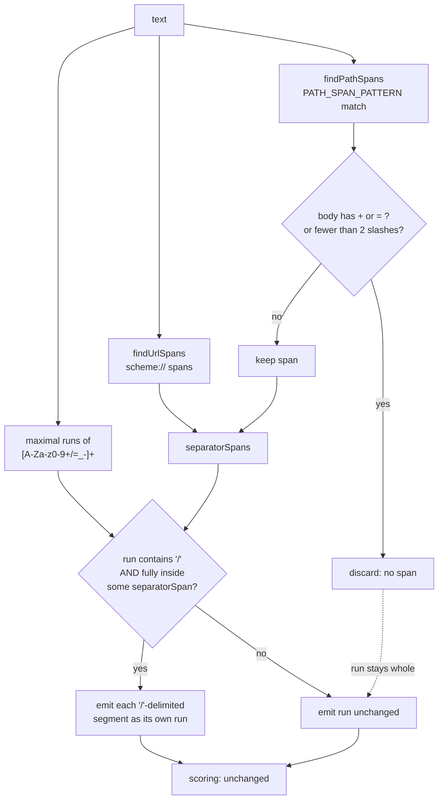

# Design

## Context

See `proposal.md` — Why. This design covers only *how*.

The constraint that shapes everything below is the tokenizer in
`src/entropy-rule.js`:

- `CANDIDATE_RUN_PATTERN = /[A-Za-z0-9+/=_-]+/g` — `.` is **not** in the
  charset, so a path like `/home/user/.worktrees/PLT-885-…/.venv` is
  already broken into *three* candidate runs at its `.` characters. Only
  the first of them begins with the anchoring `/`.
- `findUrlSpans` + `isWithinAnySpan` gate the existing `/`-splitting
  behaviour in `findCandidateRuns`, and `isWithinAnySpan` requires **full
  containment** of the run in the span.

Those two facts together force the shape of the fix: the path span must be
detected over a charset that *includes* `.` (and everything else that is
not a span terminator), so one span covers the whole path and each of the
path's several candidate runs is fully contained in it. A span detected
over the candidate charset alone would cover only the first fragment and
would leave `worktrees/PLT-885-…/` — the run that actually carries the
false positive — outside every span.

### Verified current behaviour (measured, not assumed)

The tokenizer and scorer were replicated and run over candidate strings to
pin the numbers this design depends on:

| Input | Longest scored run | H | Flagged today? |
| --- | --- | --- | --- |
| `` `/home/user/.worktrees/PLT-885-slack-mention-dm-user-id/.venv` `` | `worktrees/PLT-885-slack-mention-dm-user-id/` (43) | 4.2398 | **no** |
| `/var/lib/jenkins/workspace/PLT-885_slack-mention-DM-userID/build2` | whole string (65) | 4.6911 | yes |
| `C:/Users/jdoe/AppData/Local/Temp/BuildOutput-2024Q3/x86_Rel` | `/Users/…/x86_Rel` (57) | 4.7334 | yes |
| `../build/Out2/Xq7Bench/Kube-Cfg/report_v3/final` | (45) | 4.6250 | yes |
| `~/go/pkg/Mod/Xq7Bench/Kube-Cfg/build_Out2/report` | (47) | 4.5190 | yes |

**The exact string quoted in `proposal.md` does not reproduce the
false positive**: at H = 4.2398 it is below the 4.5 base64 threshold. The
class of bug is real and reproduces readily on slightly more
character-diverse real paths (rows 2–5, all verified), but that specific
literal is a *near miss*, not a hit. This changes nothing about the fix —
it changes what the tests may assert. See Open Questions.

## Goals / Non-Goals

**Goals**

- One span-detection helper, `findPathSpans`, symmetric with
  `findUrlSpans` in name, shape, and role.
- A single, minimal generalization at the one place `urlSpans` is consumed.
- Anchors that are structurally unambiguous, so the new false-negative
  surface is bounded and quantifiable.

**Non-Goals**

- Changing `CANDIDATE_RUN_PATTERN`, the thresholds, the allowlist, the JWT
  pre-pass, or the short-password path. All are untouched.
- Changing `findUrlSpans` or any existing URL behaviour.
- Detecting unanchored path-shaped text (`origin/branch`, `a/b/c`,
  `PATH=/usr/bin:/usr/local/bin`, `x=./a/b`). Out of scope per the
  proposal; the `=`/`:` prefix is not a boundary, so these deliberately
  yield no span.

## Decisions

### D1 — One boundary character class, used for both the anchor and the terminator

```js
// boundary/terminator set, used twice in PATH_SPAN_PATTERN
[\s"'`()\[\]{}<>]
```

This is `findUrlSpans`' terminator set (`[^\s"'<>()]`) plus backtick and
square/curly brackets. Backtick is mandatory: the motivating output is
Markdown-quoted. Using the *same* class for the left anchor boundary and
the right terminator keeps the rule symmetric and memorable: **a path span
runs from a boundary to the next boundary.**

### D2 — `PATH_SPAN_PATTERN`

```js
const PATH_SPAN_PATTERN =
  /(?<![^\s"'`()\[\]{}<>])(?:[A-Za-z]:\/|(?:\.\.?|~)\/|\/)[^\s"'`()\[\]{}<>]*/g;
```

Three parts:

1. **`(?<![^\s"'\`()\[\]{}<>])`** — negative lookbehind for "any character
   that is *not* a boundary character". Chosen over
   `(?<=^|[\s"'\`()…])` because it is fixed-width, needs no `^`
   alternation, and is true at start-of-string for free.
2. **The anchor alternation**, in this order:
   - `[A-Za-z]:\/` — Windows drive-letter forward-slash absolute. The
     boundary is checked before the *drive letter*, which is what makes
     this alternative load-bearing: in `C:/Users/…` the `/` itself is
     preceded by `:`, not a boundary, so the bare-`/` alternative can
     never match it.
   - `(?:\.\.?|~)\/` — relative. `\.\.?` prefers `..` and backtracks to
     `.`, so `./`, `../`, `~/` all match and `...../a/b` correctly does
     **not** (the `.`/`..` is not itself at a boundary).
   - `\/` — POSIX absolute.

   Order is cosmetic, not semantic: at any one start offset at most one
   alternative can match, because each begins with a disjoint character.
3. **`[^\s"'\`()\[\]{}<>]*`** — greedy body over *everything that is not a
   terminator*. This is the piece that makes `.worktrees` and `.venv` part
   of the same span.

**Walk-through — `` `/home/user/.worktrees/PLT-885-slack-mention-dm-user-id/.venv` ``**

- Offset 0 (`` ` ``): lookbehind passes (start of string) but no anchor
  alternative matches a backtick. No match.
- Offset 1 (`/`): preceded by `` ` ``, which *is* a boundary character, so
  the negative lookbehind passes. Third alternative consumes `/`.
- The body then consumes
  `home/user/.worktrees/PLT-885-slack-mention-dm-user-id/.venv` — `.`,
  `-`, and `/` are all non-terminators — and stops at the closing
  backtick.
- Result: exactly one span, `{ start: 1, end: 61 }`, covering the whole
  path and nothing else. **Verified.**

That span fully contains all three of the path's candidate runs
(`/home/user/`, `worktrees/PLT-885-…-id/`, `venv`), so every one of them
is `/`-split. Without the `.`-inclusive body, the span would end at
`/home/user/` and the offending middle run would remain unsplit.

Further verified anchor behaviour:

| Input | Spans found |
| --- | --- |
| `https://example.com/a/b` | none (every `/` is preceded by `:` or `/`) |
| `(/etc/hosts) [/tmp/x/y] {/a/b/c} </srv/www/x>` | all four, brackets excluded |
| `d:/data/logs/app.log and Z:/x/y` | both |
| `~/.config/opencode/config.json` | one, whole string |
| `PATH=/usr/bin:/usr/local/bin`, `x=./a/b`, `...../a/b`, `no-anchor/foo/bar` | none (by design) |

### D3 — The discard guard is a post-match filter inside `findPathSpans`, never inline in the pattern

A matched span is **discarded** (not returned) when either holds of the
whole matched text:

- it contains `+` or `=`; or
- it contains fewer than 2 `/` characters in total (the anchoring `/`
  counts toward the total; for the Windows form the `/` of `X:/` counts).

This **must not** be expressed as a lookahead inside `PATH_SPAN_PATTERN`.
The body quantifier is `*`, so a lookahead constraint does not discard the
match — the engine **backtracks to a shorter body** that satisfies it. A
blob like `/AbCd+EfGh…` would then produce a truncated span ending just
before the `+`, which still gates a partial `/`-split of a real base64
blob: precisely the false negative the guard exists to prevent. A
post-match all-or-nothing filter has no such failure mode, and it keeps
the two independent guards readable as two plain predicates.

Placing the filter in `findPathSpans` (rather than in `findCandidateRuns`)
also means "discarded" and "never detected" are indistinguishable to every
caller — there is one definition of a path span, and it is already
filtered.

### D4 — `findPathSpans(text)`

```js
export function findPathSpans(text): Array<{ start: number, end: number }>
```

Exactly `findUrlSpans`' shape and contract: source order, absolute offsets,
`end` exclusive. Placed immediately after `findUrlSpans` in the module,
with `PATH_SPAN_PATTERN` beside `URL_SPAN_PATTERN`. Exported, because the
existing tests exercise `findUrlSpans` directly and the new tests need the
same access.

Spans may overlap other spans (two adjacent paths cannot, but a path span
and a URL span could in pathological input). This is harmless:
`isWithinAnySpan` is a `.some`, so overlap can only ever make more runs
eligible for splitting, never fewer, and the splitting operation is
idempotent per run.

### D5 — The generalization in `findCandidateRuns`

The change is two lines. The local `urlSpans` becomes the union of both
span kinds and is renamed to say what it now means:

```js
// was: const urlSpans = findUrlSpans(text);
const separatorSpans = [...findUrlSpans(text), ...findPathSpans(text)];
…
if (runText.includes("/") && isWithinAnySpan({ start, end }, separatorSpans)) {
```

Nothing else in the function changes — the split loop, the offset
arithmetic, the empty-segment skip, and the `continue` all stay as they
are. The rename is required by the repo's own convention that a name
states its content; leaving it as `urlSpans` while it holds path spans
would be actively misleading. The module-level comment above
`URL_SPAN_PATTERN` and the JSDoc on `findCandidateRuns` both mention URLs
by name and must be updated to say "URL span or path span".

### D6 — Tokenization flow



### Alternatives considered

- **Inline guards via lookahead** — rejected, see D3 (backtracking to a
  truncated span).
- **Detect path spans over the candidate charset plus `.` only** — a
  smaller body class, but it breaks on any path segment containing another
  ordinary character (space-free punctuation such as `@` in
  `…/pkg/mod/github.com/Azure/azure-sdk-for-go@v68.0.0/sdk`, or `:`), and
  buys nothing: the terminator set already bounds the span.
- **Merge path detection into `URL_SPAN_PATTERN`** — one regex, but it
  would apply the URL span's terminator set and *no* discard guard to path
  spans, silently widening the URL fix's own false-negative surface. The
  guards are specific to the weaker anchor and must not leak onto the
  `scheme://` anchor.
- The two alternatives rejected at proposal level (drop `/` from the
  charset; score every `/`-segment unconditionally) are not re-litigated
  here.

## Delta spec plan

The engineer writes
`openspec/changes/fix-filesystem-path-entropy-false-positive/specs/high-entropy-secret-detection/spec.md`
with a single `## MODIFIED Requirements` section. The requirement **header
text is unchanged** — `### Requirement: Treat URL Path Separators As
Candidate-Run Boundaries` — because OpenSpec matches a MODIFIED block to
the existing requirement by header, and the proposal specifies MODIFIED
(a rename would have to be REMOVED + ADDED, which is not the approved
scope). See Open Questions.

**Restated requirement body (post-change), verbatim:**

> The system SHALL treat the `/` character as a boundary that ends a
> base64/hex candidate run — never as a charset-continuation character —
> whenever that `/` falls within a detected URL span (a `scheme://` span
> beginning with a recognized URL scheme) or within a detected filesystem
> path span, and SHALL continue to evaluate each `/`-delimited segment of
> such a span independently against the existing base64/hex detection
> rules. A filesystem path span is a maximal run of non-boundary
> characters (boundary characters being whitespace, `"`, `'`, `` ` ``,
> and the bracket characters `(`, `)`, `[`, `]`, `{`, `}`, `<`, `>`)
> beginning at one of three anchors, each of which must itself begin at a
> boundary character or at the start of the scanned text: a `/` (POSIX
> absolute), a single letter followed by `:` and `/` (Windows
> forward-slash absolute), or a `.`, `..`, or `~` followed by `/`
> (relative). A path span's body includes every non-boundary character,
> `.` among them, so a single span covers a whole path rather than only
> its base64/hex-charset fragments. A detected path span SHALL be
> discarded — leaving the runs it covers tokenized exactly as they were
> before this requirement — when its text contains a `+` or an `=`, or
> when it contains fewer than two `/` characters in total. Outside every
> detected URL span and every retained path span, or for a candidate run
> inside such a span that contains no `/`, tokenization is unaffected by
> this requirement.

**Scenario set the delta must contain** (the three existing scenarios are
restated as part of the MODIFIED block; titles must match this list
exactly so specs, tests, and this design cannot drift):

*Restated unchanged:*

1. `#### Scenario: Does not flag an ordinary multi-segment URL path as one high-entropy blob`
2. `#### Scenario: Still flags a genuinely high-entropy segment within a URL path`

*Restated with an amended body* (its previous "outside any URL span"
wording is now contradicted by path spans, and must be narrowed to
"outside any URL span and any retained path span"):

3. `#### Scenario: Does not affect a base64/hex run outside any URL or path span`

*New:*

4. `#### Scenario: Does not flag an ordinary POSIX absolute path as one high-entropy blob`
5. `#### Scenario: Does not flag an ordinary Windows drive-letter forward-slash path as one high-entropy blob`
6. `#### Scenario: Does not flag an ordinary relative path as one high-entropy blob`
7. `#### Scenario: A path span covers dot-prefixed segments as part of the same span`
8. `#### Scenario: Still flags a genuinely high-entropy segment within a filesystem path`
9. `#### Scenario: Does not split a slash-containing run whose path span contains a plus or equals character`
10. `#### Scenario: Does not split a slash-containing run whose path span contains fewer than two slashes`
11. `#### Scenario: Does not detect a path span whose anchor is not at a boundary character`
12. `#### Scenario: Does not affect a native Windows backslash path`

Scenario 3's renamed title means the delta needs the old title removed and
the new one added within the same MODIFIED requirement block — which a
full-body restatement does inherently.

## Test plan

Two files, following the existing conventions exactly.

**`test/entropy-fixtures.js`** — a new exported `PATH_FIXTURES` array,
same `{ name, content, expectFinding }` shape as `ENTROPY_FIXTURES`, kept
separate for the same reason `SHORT_PASSWORD_FIXTURES` is separate: each
array documents which detection path it exercises. Every entry's measured
entropy goes in its `name`, per the file's existing convention.

| # | `content` | `expectFinding` | Pins |
| --- | --- | --- | --- |
| F1 | `` `/home/user/.worktrees/PLT-885-slack-mention-dm-user-id/.venv` `` | `false` | The proposal's literal. **Measured H = 4.2398 — below threshold today**, so this is a documentation/span fixture, not a regression guard; its `name` must say so (see Open Questions). |
| F2 | `/var/lib/jenkins/workspace/PLT-885_slack-mention-DM-userID/build2` | `false` | POSIX absolute. H = 4.6911 over 65 chars — **fails before the fix, passes after**. The real regression guard. |
| F3 | `C:/Users/jdoe/AppData/Local/Temp/BuildOutput-2024Q3/x86_Rel` | `false` | Windows drive letter. H = 4.7334 over 57 chars. Fails before the fix. |
| F4 | `../build/Out2/Xq7Bench/Kube-Cfg/report_v3/final` | `false` | Relative `../`. H = 4.6250 over 45 chars. Fails before the fix. |
| F5 | `~/go/pkg/Mod/Xq7Bench/Kube-Cfg/build_Out2/report` | `false` | Relative `~/`. H = 4.5190 over 47 chars. Fails before the fix. |
| F6 | `./Kube-Cfg/build_Out2/Xq7Bench/report_v3/final` | `false` | Relative `./`. Fails before the fix. |
| F7 | `warning: `` `/home/dev/src/Kube-Cfg/build_Out2/Xq7Bench/report` `` was ignored` | `false` | The real-world framing: backtick-quoted path embedded in tool output. Span must start after the backtick. Fails before the fix. |
| F8 | `C:\Users\jdoe\AppData\Local\Temp\BuildOutput-2024Q3\x86_Rel` | `false` | Native backslash path — asserts the no-change claim holds. |

All eight are plain paths and safe to write as literals. Fixtures that
*contain* a secret must **not** be: construct them programmatically in the
test file (as the existing URL tests already do with
`Array.from({ length: 36 }, (_, i) => i.toString(36)).join("")`, H =
log2(36) ≈ 5.1699), so this repo's own redactor cannot mangle the test
sources.

**`test/entropy-rule.test.js`** — mirror the existing URL section: a
`// spec:` comment pointing at the delta spec file, then three describes.

*`describe("findPathSpans")`*

- T1 POSIX: finds one span covering the whole path; assert via
  `text.slice(start, end)`.
- T2 backtick-wrapped (F1's literal): exactly one span,
  `{ start: 1, end: 61 }`, slicing back to the path **without** either
  backtick. This is the `.`-inclusive-body assertion — spell out in a
  comment that it proves `.worktrees` and `.venv` are inside the one span.
- T3 Windows `C:/…`: span starts at the drive letter, not the `/`.
- T4 relative: one span each for `./a/b/c`, `../a/b/c`, `~/a/b/c`.
- T5 brackets/quotes: `(/etc/hosts) [/tmp/x/y] {/a/b/c} </srv/www/x>`
  yields four spans, no bracket characters included.
- T6 no anchor: `PATH=/usr/bin:/usr/local/bin`, `x=./a/b`, `...../a/b`,
  `no-anchor-here/foo/bar`, `C:\Users\x` → `[]` for each.
- T7 a `scheme://` URL alone yields no path span (the URL span already
  governs it).
- T8 discard guard — `+`: `"/<18 base64 chars>+<18 base64 chars>"`
  (quote-wrapped, ≥2 slashes, contains `+`) → `[]`.
- T9 discard guard — `=`: same but with a trailing `=` → `[]`.
- T10 discard guard — slash count: `"/<36 base64 chars>"` (one slash
  total) → `[]`; and `a / b` → `[]`.

*`describe("findCandidateRuns — filesystem path separator handling")`*

- T11 splits a run at `/` when the run falls inside a path span: assert
  the exact `runs.map(r => r.text)` array for F2.
- T12 regression guard: a `/`-containing run with no path anchor and no
  URL span is still one run (extends the existing
  `value=aGVsbG8/d29ybGQ` test's intent to the path case).

*`describe("findHighEntropyFindings — filesystem path false-positive fix")`*

- T13 `PATH_FIXTURES` loop asserting `expectFinding`, mirroring the
  existing `ENTROPY_FIXTURES` / `SHORT_PASSWORD_FIXTURES` loops.
- T14 **still flags a genuine secret inside a path**:
  `/home/user/tokens/${secret36}/file.txt` → exactly one finding, and
  `text.slice(start, end) === secret36`. Verified: the finding is also
  *narrowed* from the whole path (offsets 0–59 today) to the secret alone
  (18–54), which is a strict improvement worth asserting.
- T15 same as T14 but backtick-wrapped inside a sentence, to pin that the
  span boundary logic does not shift the finding offsets.
- T16 **false-negative guard, `+`**: a quoted standard-base64 secret
  *beginning* with `/` and containing `+` → exactly one finding covering
  the whole blob (verified: H = 5.25, reported unsplit).
- T17 **false-negative guard, `=`**: a quoted standard-base64 secret with
  an *internal* `/` and a trailing `=` → exactly one finding covering the
  whole blob (verified: H = 5.25, reported unsplit).
- T18 **false-negative guard, slash count**: a quoted base64 secret
  beginning with `/` and containing no other `/` → exactly one finding,
  unsplit (verified: H = 5.21).
- T19 documented residual limitation, asserted rather than left implicit —
  see Risks. Written in the style of the existing "accepted limitation"
  test at the end of the URL section, with a comment explaining why it is
  accepted.

## Risks / Trade-offs

- **Residual false-negative surface** → *accepted, documented, not further
  mitigated.* A standard-base64 blob that (a) sits at a boundary
  character, (b) begins with `/` (or is preceded by a `.`/`..`/`~` that
  itself sits at a boundary), (c) contains at least one further `/`,
  (d) contains no `+` and no `=`, and (e) splits into segments that each
  fall below their charset's length floor or entropy threshold, is no
  longer reported. For a 44-character unpadded blob the joint probability
  of (b)–(d) is roughly 1/64 × 0.5 × 0.5 ≈ 0.4%. The independent
  short-password path (14–22 characters, `/`-free tokenization) is an
  unchanged partial backstop for the surviving fragments. This residual is
  the deliberate price of an anchor much weaker than `scheme://`; the
  proposal accepted it and this design does not attempt to shrink it
  further, because every further narrowing re-widens the false-positive
  surface the change exists to close.
- **A run straddling into a path span from outside it is not split** →
  *inherited, unchanged.* `isWithinAnySpan` requires full containment;
  this is already a documented accepted limitation of the URL fix and
  behaves identically here.
- **Overlapping URL and path spans** → *no mitigation needed.* Union
  semantics via `.some` can only widen eligibility, and splitting is
  per-run and idempotent.
- **Comment drift** → the module comment above `URL_SPAN_PATTERN` and the
  `findCandidateRuns` JSDoc both name URLs specifically; leaving them
  stale would mislead the next reader more than the code would. Updating
  them is part of the work, not follow-up.

## Component breakdown

| Component | Work kind | Done criterion |
| --- | --- | --- |
| `PATH_SPAN_PATTERN` + `findPathSpans` in `src/entropy-rule.js` | Application code | Exported; returns `{start,end}` spans; discard guard applied post-match; T1–T10 pass. |
| `findCandidateRuns` generalization + comment/JSDoc updates | Application code | `separatorSpans` union in place; every existing URL test still passes unchanged; T11–T12 pass. |
| Delta spec file | Spec authoring | One `## MODIFIED Requirements` block, header text unchanged, body as restated above, all 12 scenario titles present; `openspec validate --strict` clean. |
| `PATH_FIXTURES` in `test/entropy-fixtures.js` | Test code | Eight fixtures F1–F8, each `name` carrying its measured entropy. |
| Path test sections in `test/entropy-rule.test.js` | Test code | T1–T19 present and passing; secrets constructed programmatically, never as literals. |
| Pre-fix failure check | Verification | F2–F7 and T11 demonstrably fail against `main`'s `src/entropy-rule.js` before the fix is applied. |

## Open Questions

1. **`proposal.md`'s reproduction string is a near miss (H = 4.2398 vs the
   4.5 threshold), not an actual false positive.** The class of bug is
   real and reproduces on rows 2–5 of the Context table, so the fix and
   its scope are unaffected — but the proposal's "Why" overstates that one
   literal, and F1 cannot serve as the regression guard the commission
   asked it to be. This design keeps F1 as a span-detection/documentation
   fixture (labelled as such) and makes F2 the regression guard. Decision
   needed from the user or the commissioning engineer: leave `proposal.md`
   as written with F1's `name` carrying the caveat (recommended — the
   proposal is approved and the observed `ruff` output was almost
   certainly a longer, more diverse path than the sanitized form quoted),
   or amend the proposal's quoted string to a verified-reproducing one.
2. **The MODIFIED requirement keeps the title "Treat URL Path Separators
   As Candidate-Run Boundaries" while now also governing filesystem
   paths.** Keeping it is what makes a MODIFIED delta legal; renaming it to
   "…URL And Filesystem Path Separators…" would require REMOVED + ADDED,
   which exceeds the approved scope. Recommended: keep the title now, and
   rename in a later housekeeping change if the mismatch proves confusing.
